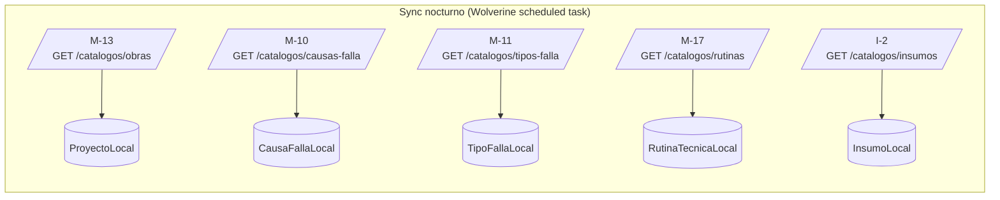

# Flujo de inspección técnica manual — paso a paso con endpoints

**Propósito:** mapa visual del ciclo completo de una inspección técnica (MVP, no monitoreo) mostrando en cada paso qué endpoint del ERP se invoca. Complementa `06-contrato-apis-erp.md` (contrato detallado) y `01-modelo-dominio.md` §15 (modelo y eventos).

**Última revisión:** 2026-05-04 (origen: revisión por flujos del usuario).

**Convenciones del diagrama:**
- Cuadros sólidos: pasos / decisiones / eventos del módulo (locales).
- Flechas punteadas con etiqueta: invocación al ERP (con código del endpoint en `06-contrato-apis-erp.md`).
- `(outbox)`: la llamada pasa por Wolverine outbox (ADR-006), no es síncrona.
- `(cache local)`: el dato se resuelve contra proyección sincronizada nocturnamente, sin llamada al ERP en tiempo real.

> **Nota sobre backends del lado ERP:** este módulo (Inspecciones, en Azure) usa **Marten 7 sobre PostgreSQL 16** (event store + CQRS). Los endpoints del lado ERP que se invocan en este flujo golpean **backends distintos**:
> - **Preoperacional (P-1..P-6):** SQL Server relacional on-prem. Sin event store. Idempotencia explícita vía tabla `idempotency_key → response_body` (ver §3.1 del contrato).
> - **MYE núcleo (M-1..M-17):** SQL Server relacional on-prem (asumido — confirmar con David).
> - **Inventario (I-1, I-2):** SQL Server relacional on-prem (asumido).
>
> El módulo nunca asume que el ERP emite eventos. Toda integración es **REST sobre VPN** (ADR-001). Lo único event-sourced es el stream del aggregate `Inspeccion` en el módulo Azure.

---

## 1. Pre-condiciones — cache local poblada por sync nocturno



Estas proyecciones se consultan offline durante la inspección. Stale-while-revalidate hasta 24h si VPN cae (ADR-004).

---

## 2. Flujo principal de inspección técnica manual

```mermaid
flowchart TD
    Start([Técnico abre PWA Sinco MYE]) --> A[Buscar equipo<br/>autocomplete q=]
    A -. "M-3<br/>GET /equipos?q=" .-> ERP1[(ERP)]
    A --> B[Tap en equipo seleccionado]
    B -. "M-3b<br/>GET /equipos/{equipoCodigo}" .-> ERP2[(ERP)]
    B --> Bv["Cache local:<br/>EquipoLocal.partes[]<br/>EquipoLocal.rutinaTecnicaId"]

    Bv --> C{equipo.rutinaTecnicaId<br/>≠ null?}
    C -- No --> Block([❌ Bloqueado<br/>Invariante I-I2<br/>'sin rutina técnica asignada']):::error
    C -- Sí --> D{Otra inspección<br/>EnEjecucion para<br/>el equipo?}
    D -- Sí --> Reuse([Abre la existente<br/>I-I1 collaborative]):::warn
    D -- No --> E[Capturar GPS + FechaReportada<br/>+ LecturasMedidor]

    E --> F[Comando IniciarInspeccion]
    F --> G((InspeccionIniciada_v1)):::evt
    G --> Phase2[Inspección EnEjecucion]

    %% === FASE: trabajar con novedades preop ===
    Phase2 --> H{¿Importar novedades<br/>preoperacional?}
    H -- Sí --> I[Tap 'Importar novedades']
    I -. "P-1<br/>GET /preop/novedades?q=" .-> ERP3[(ERP)]
    I --> J[Lista de novedades pendientes<br/>del equipo]
    J --> K{Tap en novedad<br/>para expandir?}
    K -- Sí --> L[Detalle textual]
    L -. "P-2<br/>GET /preop/novedades/{id}" .-> ERP4[(ERP)]
    L --> M{¿Tiene adjuntos?}
    M -- Sí --> N[Ver thumbnails]
    N -. "P-3<br/>GET /preop/novedades/{id}/adjuntos" .-> ERP5[(ERP)]
    N --> O{Abrir adjunto<br/>completo?}
    O -- Sí --> P[Ver foto/PDF]
    P -. "P-4<br/>GET /preop/adjuntos/{id}" .-> ERP6[(ERP)]
    P --> Q
    O -- No --> Q
    M -- No --> Q[Decisión sobre la novedad]

    Q --> R{¿Qué hacer?}
    R -->|Verificar / Seguimiento| S[Wizard de hallazgo<br/>desde novedad]
    S --> S1((HallazgoRegistrado_v1<br/>Origen=PreOperacional)):::evt
    S1 -. "P-5<br/>POST /preop/novedades/{id}/verificar<br/>(outbox)" .-> ERP7[(ERP)]

    R -->|Descartar 👁 ojo tachado| T[Motivo autogenerado]
    T --> T1((NovedadPreopDescartada_v1)):::evt
    T1 -. "P-6<br/>POST /preop/novedades/descartar<br/>(outbox, array de 1)" .-> ERP8[(ERP)]

    K -- No --> Phase3
    S1 --> H
    T1 --> H
    H -- No --> Phase3{¿Más trabajo?}

    %% === FASE: hallazgo manual + repuestos + adjuntos ===
    Phase3 -->|+ Agregar hallazgo manual| U[Wizard hallazgo manual]
    U --> U0[Selector parte<br/>desde cache M-3b]
    U0 --> U1[Causa + Tipo de falla<br/>desde cache local]
    U1 --> U2((HallazgoRegistrado_v1<br/>Origen=Manual)):::evt
    U2 --> Phase3a{¿Estimar<br/>repuestos?}

    Phase3a -- Sí --> V[Buscar insumo<br/>autocomplete q=]
    V --> V0[(InsumoLocal cache)]
    V0 -. "I-1<br/>GET /insumos?q=<br/>(fallback si miss)" .-> ERP9[(ERP)]
    V --> V1((RepuestoEstimado_v1)):::evt
    V1 --> Phase3b
    Phase3a -- No --> Phase3b{¿Adjuntar<br/>archivo?}

    Phase3b -- Sí --> W[Cliente solicita<br/>SAS al backend módulo]
    W --> W0[Cliente sube binario<br/>directo a Azure Blob]
    W0 --> W1((AdjuntoSubido_v1)):::evt
    W1 --> Phase3
    Phase3b -- No --> Phase3
    Phase3 -->|Suficiente| X[Capturar Diagnóstico<br/>+ Dictamen]

    %% === FASE: firma ===
    X --> Y{Validaciones<br/>V-F1..V-F7 OK?}
    Y -- No --> Back([Volver a corregir]):::warn
    Y -- Sí --> Z[Comando FirmarInspeccion]
    Z --> Z1((3 eventos atómicos:<br/>DiagnosticoEmitido_v1<br/>DictamenEstablecido_v1<br/>InspeccionFirmada_v1)):::evt

    Z1 --> Sync[Saga SincronizarDictamenVigenteSaga]
    Sync -. "M-W-1<br/>PUT /equipos/{equipoCodigo}/dictamen-vigente<br/>(outbox)" .-> ERP10[(ERP)]

    Z1 --> Branch{¿Hay hallazgos<br/>RequiereIntervencion?}
    Branch -- No --> NoOT((InspeccionCerradaSinOT_v1<br/>motivo=AutomaticoSinIntervencion)):::evt
    NoOT --> EndNoOT([✓ Fin sin OT]):::ok

    %% === FASE: aprobación de OT ===
    Branch -- Sí --> Wait[Estado derivado:<br/>EsperandoAprobacionOT]
    Wait --> AppList[Aprobador entra a<br/>'Pendientes OT'<br/>capability generar-ot]
    AppList --> AppDec{Decisión}

    AppDec -->|Rechazar| Rej[Comando RechazarGenerarOT<br/>+ motivo]
    Rej --> Rej1((GeneracionOTRechazada_v1<br/>+ InspeccionCerradaSinOT_v1<br/>motivo=RechazadaPorAprobador)):::evt
    Rej1 --> EndRej([✓ Fin rechazada]):::ok

    AppDec -->|Generar OT| Gen[Comando GenerarOT<br/>+ Responsable<br/>Proyecto / DepartamentoEquipos]
    Gen --> Gen1((OTSolicitada_v1)):::evt
    Gen1 --> SagaOT[Saga EjecutarOTSaga]
    SagaOT -. "M-1<br/>POST /mye/ot-correctivas<br/>(outbox + retry)" .-> ERP11[(ERP)]

    SagaOT --> M1Result{Respuesta MYE}
    M1Result -->|200 OK| OTOk((InspeccionCerrada_v1<br/>+ otCorrectivaIdSinco<br/>+ otCorrectivaNumero)):::evt
    M1Result -->|4xx perm| Fail((OTGeneracionFallida_v1)):::error
    M1Result -->|5xx + agotó retry| Fail
    Fail --> CierrePend[Estado:<br/>CierrePendienteOT]:::warn
    CierrePend -.->|reintento manual<br/>desde panel admin| Gen

    OTOk --> Pdf[Saga GenerarPdfInspeccionSaga<br/>QuestPDF local]
    Pdf --> PdfEvt((PdfInspeccionGenerado_v1)):::evt
    PdfEvt -. "M-1b<br/>POST /mye/ot-correctivas/{id}/adjuntos<br/>multipart (outbox)" .-> ERP12[(ERP)]
    PdfEvt --> PdfOk((PdfAdjuntadoAOT_v1)):::evt
    PdfOk --> EndOt([✓ Fin con OT + PDF]):::ok

    %% Push SignalR (no ERP)
    OTOk -. "SignalR push<br/>OTGenerada al cliente<br/>(ADR-005)" .-> Client[(Cliente PWA)]
    NoOT -. "SignalR push<br/>InspeccionCerrada al cliente" .-> Client

    classDef evt fill:#e3f2fd,stroke:#1976d2
    classDef ok fill:#e8f5e9,stroke:#388e3c
    classDef warn fill:#fff8e1,stroke:#f57c00
    classDef error fill:#ffebee,stroke:#d32f2f
```



---

## 3. Tabla resumen de endpoints invocados

| Fase | Endpoint | Cuándo se invoca | Frecuencia | ¿Outbox? |
|---|---|---|---|---|
| **Iniciar** | `M-3 GET /equipos?q=` | Autocomplete al buscar equipo | 1+ por sesión | No (síncrono) |
| **Iniciar** | `M-3b GET /equipos/{equipoCodigo}` | Tap en equipo seleccionado | 1 por inicio | No |
| **Importar preop** | `P-1 GET /preop/novedades?q=` | Tap "Importar novedades" | 1+ por inspección | No |
| **Importar preop** | `P-2 GET /preop/novedades/{id}` | Tap para expandir novedad | 1 por novedad expandida | No |
| **Importar preop** | `P-3 GET /preop/novedades/{id}/adjuntos` | Si la novedad tiene adjuntos | 1 por novedad con adjuntos | No |
| **Importar preop** | `P-4 GET /preop/adjuntos/{id}` | Tap en thumbnail | 1 por adjunto abierto | No |
| **Verificar/Seguim.** | `P-5 POST /preop/novedades/{id}/verificar` | Botón "Verificar" / "Seguimiento" | 1 por novedad asignada | **Sí** |
| **Descartar** | `P-6 POST /preop/novedades/descartar` | Tap icono "ojo tachado" | 1 por novedad descartada | **Sí** |
| **Repuestos** | `I-1 GET /insumos?q=` | Solo fallback si cache miss | Raro (cache primero) | No |
| **Firma** | `M-W-1 PUT /equipos/{id}/dictamen-vigente` | Tras `InspeccionFirmada_v1` | 1 por firma (con o sin OT) | **Sí** |
| **OT** | `M-1 POST /mye/ot-correctivas` | Tras `OTSolicitada_v1` (aprobación manual) | 1 por OT aprobada | **Sí** |
| **OT** | `M-1b POST /mye/ot-correctivas/{id}/adjuntos` | Tras éxito M-1 + PDF generado | 1 por OT exitosa | **Sí** |

**Total endpoints en el flujo técnica completo:** 12 distintos (6 GET síncronos + 4 POST async vía outbox + 1 PUT async + 1 GET fallback).

---

## 4. Eventos del módulo emitidos a lo largo del flujo

```
1. InspeccionIniciada_v1                ← IniciarInspeccion (síncrono)
2. HallazgoRegistrado_v1 (×N)            ← RegistrarHallazgo (verificar / seguim. / manual)
   └─ + AdjuntoSubido_v1 (×N)            ← AdjuntarArchivo
   └─ + RepuestoEstimado_v1 (×N)         ← EstimarRepuesto
3. NovedadPreopDescartada_v1 (×N)        ← DescartarNovedadPreop
4. DiagnosticoEmitido_v1     ┐
   DictamenEstablecido_v1    │           ← FirmarInspeccion (atómico — único SaveChangesAsync)
   InspeccionFirmada_v1      ┘

Bifurcación según hallazgos RequiereIntervencion:

Sin OT:
  5a. InspeccionCerradaSinOT_v1          ← saga CerrarInspeccionSaga (auto)
                                            motivo=AutomaticoSinIntervencion

Con OT (aprobada):
  5b. OTSolicitada_v1                    ← GenerarOT (aprobador)
  6.  InspeccionCerrada_v1               ← saga EjecutarOTSaga (éxito M-1)
  7.  PdfInspeccionGenerado_v1           ← saga GenerarPdfInspeccionSaga
  8.  PdfAdjuntadoAOT_v1                 ← saga EjecutarOTSaga (éxito M-1b)

Con OT (rechazada):
  5c. GeneracionOTRechazada_v1 ┐         ← RechazarGenerarOT (atómico)
      InspeccionCerradaSinOT_v1┘            motivo=RechazadaPorAprobador

Con OT (fallo de integración):
  5d. OTGeneracionFallida_v1             ← saga EjecutarOTSaga (4xx perm o agotó retry)
                                            estado=CierrePendienteOT (no terminal)
```

Detalle de eventos en `01-modelo-dominio.md` §15.4 y `05-catalogo-eventos.md`.

---

## 5. Decisiones arquitectónicas clave que se ven en el flujo

| Decisión | Dónde aplica | Referencia |
|---|---|---|
| Outbox transaccional para todos los POST al ERP | P-5, P-6, M-1, M-1b, M-W-1 | ADR-006 (`§16` modelo) |
| Idempotencia real con `Idempotency-Key` ≥30 días | Todos los POST async | §1.4 contrato + ADR-003 |
| Verificar/descartar **al asignar**, NO al firmar | P-5, P-6 (tiempo real, no saga) | Decisión 2026-05-04 |
| OT **manual** con capability `generar-ot` | Bifurcación tras firma con `RequiereIntervencion` | ADR-007 (§17 modelo) |
| Asignación rutina técnica per-equipo (cardinalidad 1) | M-3b `rutinaTecnicaId` | Decisión 2026-05-04 (β) |
| SignalR push al cliente cuando termina la integración | OT generada / cierre sin OT | ADR-005 |
| `int` para PKs del ERP, `Guid` para IDs internos del módulo | Todos los DTOs | Decisión 2026-05-04 (1b) |

---

## 6. Lo que NO está en este diagrama

- **Sync nocturno de catálogos** — ver §1 arriba (background, no parte del flujo del técnico).
- **Inspección de monitoreo (Fase 2)** — flujo distinto (`02e-wireframes-monitoreo.html`).
- **Seguimientos (`SeguimientoHallazgo`)** — aggregate paralelo, ciclo independiente (§15.8 modelo).
- **Cancelación** — variante alternativa de la firma. Estado terminal `Cancelada` sin contacto MYE.
- **Edición / eliminación de hallazgos / repuestos / adjuntos** — comandos de mantenimiento durante `EnEjecucion`. No se muestran para no saturar.

---

## Referencias cruzadas

- `01-modelo-dominio.md` §15 — modelo y eventos vigentes.
- `06-contrato-apis-erp.md` — contrato detallado de cada endpoint.
- `05-catalogo-eventos.md` — fichas por evento.
- ADR-003 (idempotencia OT), ADR-005 (SignalR), ADR-006 (outbox), ADR-007 (OT manual) en §13–§17 de `01-modelo-dominio.md`.
