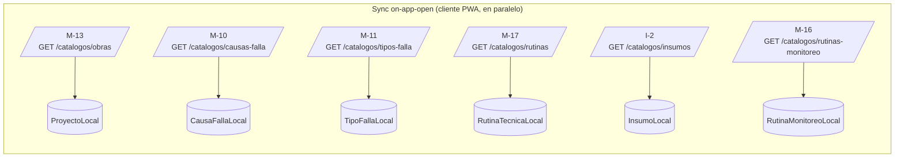

# Flujo de inspección de monitoreo (MVP — promovido 2026-05-05) — paso a paso con endpoints

> ⚠️ **REVISIÓN PENDIENTE 2026-05-05.** Dos cambios de scope sobre este doc — re-render completo pendiente:
> 1. **Asignación por grupo (decisión 2026-05-05):** equipo↔rutinas-monitoreo derivada por grupo de mantenimiento, no per-equipo. Las menciones a `rutinasMonitoreoIds[]` están **obsoletas** — el filtrado real es client-side por `r.grupoMantenimientoId == equipo.grupoMantenimientoId`.
> 2. **Monitoreo entra al MVP (decisión 2026-05-05):** antes era Fase 2 / roadmap 10.4. Las menciones a "Fase 2" en el cuerpo de este doc deben leerse como "MVP" (la roadmap §3.B' detalla los slices). Detalle en `01-modelo-dominio.md` §12.11.5 + `06-contrato-apis-erp.md` M-3b/M-16.

**Propósito:** mapa visual del ciclo completo de una inspección de tipo **Monitoreo** (MVP — promovido 2026-05-05, antes roadmap 10.4) mostrando en cada paso qué endpoint del ERP se invoca. Complementa `02f-flujo-inspeccion-tecnica-manual.md` (flujo técnica MVP), `02e-wireframes-monitoreo.html` (wireframes) y `01-modelo-dominio.md` §12.11.5 (modelo de monitoreo).

**Última revisión:** 2026-05-04 (banner 2026-05-05).

**Estado:** **MVP** — todavía no implementado en código. Promovido al MVP el 2026-05-05 (decisión Jaime — antes era Fase 2 / roadmap 10.4). Este flujo se materializa en los slices de §3.B' del roadmap.

**Diferencia clave con técnica (§12.11.5 punto 4):** monitoreo es **estructurado** — el técnico recorre los items de la rutina elegida, captura mediciones contra rangos esperados, y el sistema dispara hallazgos automáticos. Técnica es **libre** — el técnico decide qué inspeccionar.

**Convenciones del diagrama:** las mismas que `02f` (cuadros sólidos = locales, flechas punteadas = ERP, `(outbox)` = vía Wolverine, `(cache local)` = sin llamada ERP).

> **Nota sobre backends:** el módulo Inspecciones (Azure side) usa Marten 7 sobre PostgreSQL 16. Los endpoints del ERP (M-3, M-3b, M-16, etc.) golpean **SQL Server relacional on-prem** — sin event store. Idempotencia de POST async vía outbox + tabla `idempotency_key → response_body` del lado ERP. Toda integración es REST sobre VPN (ADR-001).

---

## 1. Pre-condiciones — cache local poblada por sync on-app-open (incluye M-16)

> Sync delta con `If-None-Match`/`ETag`. Sin cron nocturno (ADR-004 canonical 2026-05-05).



`RutinaMonitoreoLocal` resuelve client-side los `rutinasMonitoreoIds[]` que viajan en M-3b (cardinalidad 2-3 por equipo, asignación per-equipo en el ERP — decisión 2026-05-04).

---

## 2. Flujo principal de inspección de monitoreo

```mermaid
flowchart TD
    Start([Técnico abre PWA Sinco MYE]) --> A[Buscar equipo]
    A -. "M-3<br/>GET /equipos?q=" .-> ERP1[(ERP)]
    A --> B[Tap en equipo]
    B -. "M-3b<br/>GET /equipos/{equipoCodigo}" .-> ERP2[(ERP)]
    B --> Bv["Cache local:<br/>EquipoLocal.partes[]<br/>EquipoLocal.rutinasMonitoreoIds[]"]

    Bv --> C{rutinasMonitoreoIds<br/>≠ vacío?}
    C -- No --> Block([❌ Bloqueado<br/>'sin rutinas de monitoreo asignadas']):::error
    C -- Sí --> D[Modal 'Iniciar inspección']
    D --> E{Tipo}
    E -->|Técnica| F1([→ ver flujo técnica<br/>02f]):::warn
    E -->|Monitoreo| F2[Selector de rutina<br/>2-3 cards]
    F2 --> Bv2["Resolver definiciones contra<br/>RutinaMonitoreoLocal cache"]
    Bv2 --> F3[Técnico tap en card<br/>'Sistema eléctrico']

    F3 --> G{Otra inspección<br/>EnEjecucion para<br/>el equipo?}
    G -- Sí --> Reuse([Abre la existente<br/>I-I1 collaborative]):::warn
    G -- No --> H[Capturar GPS + FechaReportada<br/>+ LecturasMedidor]

    H --> I[Comando IniciarInspeccionMonitoreo]
    I --> J((InspeccionIniciada_v1<br/>Tipo=Monitoreo<br/>+ RutinaMonitoreoSeleccionadaId<br/>+ ItemsSnapshot)):::evt
    J --> Phase2[Inspección EnEjecucion<br/>Checklist con N items]

    %% === FASE: recorrer items ===
    Phase2 --> Iter{Próximo item}
    Iter -->|Numérico| K[Capturar valor]
    K --> K1[Handler calcula<br/>FueraDeRango contra<br/>MedicionEsperada snapshot]
    K1 --> KCheck{FueraDeRango?}
    KCheck -- No --> KOk((MedicionRegistrada_v1<br/>FueraDeRango=false)):::evt
    KCheck -- Sí --> KOut((Atómico:<br/>MedicionRegistrada_v1 FueraDeRango=true<br/>+ HallazgoRegistrado_v1<br/>Origen=Monitoreo<br/>AccionRequerida=RequiereSeguimiento)):::evt

    Iter -->|Cualitativo| L[Tap radio<br/>Bueno / Regular / Malo]
    L --> LCheck{Calificación}
    LCheck -- Bueno o Regular --> LOk((EvaluacionCualitativaRegistrada_v1)):::evt
    LCheck -- Malo --> LBad((Atómico:<br/>EvaluacionCualitativaRegistrada_v1 Malo<br/>+ HallazgoRegistrado_v1<br/>Origen=Monitoreo<br/>AccionRequerida=RequiereSeguimiento)):::evt

    Iter -->|Omitir| M[Modal motivo<br/>≥ 10 chars]
    M --> M1((ItemMonitoreoOmitido_v1)):::evt

    KOk --> Att{¿Adjuntar foto<br/>al ítem?<br/>opcional}
    KOut --> Att
    LOk --> Att
    LBad --> Att

    Att -- Sí --> N[Cliente solicita SAS]
    N --> N1[Sube binario<br/>directo a Azure Blob]
    N1 --> N2((AdjuntoSubido_v1<br/>ItemId rellenado<br/>HallazgoId=null)):::evt
    N2 --> Iter

    Att -- No --> Iter
    M1 --> Iter

    Iter -->|Recorrido completo| Phase3{¿Hallazgo<br/>manual fuera<br/>de rutina?}

    %% === FASE: hallazgo manual opcional ===
    Phase3 -- Sí --> P[+ Agregar hallazgo<br/>manual]
    P --> P1[Wizard hallazgo<br/>parte + actividad +<br/>causa + tipo de falla]
    P1 --> P2((HallazgoRegistrado_v1<br/>Origen=Manual)):::evt
    P2 --> P3{¿Adjuntar foto<br/>al hallazgo?}
    P3 -- Sí --> P4[Solicitar SAS + subir]
    P4 --> P5((AdjuntoSubido_v1<br/>HallazgoId rellenado<br/>ItemId=null)):::evt
    P5 --> P6{¿Estimar<br/>repuestos?}
    P3 -- No --> P6
    P6 -- Sí --> P7[Buscar insumo]
    P7 -. "I-1<br/>GET /insumos?q=<br/>(fallback si miss)" .-> ERP9[(ERP)]
    P7 --> P8((RepuestoEstimado_v1)):::evt
    P8 --> Phase3
    P6 -- No --> Phase3

    Phase3 -- No --> Q[Capturar Diagnóstico<br/>+ Dictamen<br/>V-F4 obligatorio]

    %% === FASE: firma ===
    Q --> R{Validaciones<br/>V-F1..V-F7 OK?}
    R -- No --> Back([Volver a corregir]):::warn
    R -- Sí --> S[Comando FirmarInspeccion]
    S --> T((3 eventos atómicos:<br/>DiagnosticoEmitido_v1<br/>DictamenEstablecido_v1<br/>InspeccionFirmada_v1)):::evt

    T --> Sync[Saga<br/>SincronizarDictamenVigenteSaga]
    Sync -. "M-W-1<br/>PUT /equipos/{equipoCodigo}/dictamen-vigente<br/>(outbox)" .-> ERP10[(ERP)]

    %% === FASE: cierre + apertura de seguimientos ===
    T --> U[Saga CerrarInspeccionSaga]
    U --> V{¿Hallazgos<br/>RequiereSeguimiento?}
    V -- Sí --> W[Por cada hallazgo seg.:<br/>Saga abre SeguimientoHallazgo]
    W --> W1((SeguimientoAbierto_v1<br/>×N — aggregate paralelo)):::evt
    W1 --> Branch
    V -- No --> Branch{¿Hallazgos<br/>RequiereIntervencion?<br/>solo si hubo manual}

    Branch -- No --> NoOT((InspeccionCerradaSinOT_v1<br/>motivo=AutomaticoSinIntervencion)):::evt
    NoOT --> EndNoOT([✓ Fin sin OT<br/>caso TÍPICO de monitoreo]):::ok

    Branch -- Sí --> Wait[Estado derivado:<br/>EsperandoAprobacionOT]
    Wait --> AppList[Aprobador entra a<br/>'Pendientes OT']
    AppList --> AppDec{Decisión}

    AppDec -->|Generar OT| Gen[Comando GenerarOT]
    Gen --> Gen1((OTSolicitada_v1)):::evt
    Gen1 --> SagaOT[Saga EjecutarOTSaga]
    SagaOT -. "M-1<br/>POST /mye/ot-correctivas<br/>(outbox + retry)" .-> ERP11[(ERP)]
    SagaOT --> OTOk((InspeccionCerrada_v1<br/>+ otCorrectivaIdSinco)):::evt
    OTOk --> Pdf[Saga GenerarPdfInspeccionSaga]
    Pdf --> PdfEvt((PdfInspeccionGenerado_v1)):::evt
    PdfEvt -. "M-1b<br/>POST /mye/ot-correctivas/{id}/adjuntos<br/>multipart (outbox)" .-> ERP12[(ERP)]
    PdfEvt --> EndOt([✓ Fin con OT + PDF]):::ok

    AppDec -->|Rechazar| Rej[Comando RechazarGenerarOT]
    Rej --> Rej1((GeneracionOTRechazada_v1<br/>+ InspeccionCerradaSinOT_v1<br/>motivo=RechazadaPorAprobador)):::evt
    Rej1 --> EndRej([✓ Fin rechazada]):::ok

    %% Push SignalR
    NoOT -. "SignalR push<br/>(ADR-005)" .-> Client[(Cliente PWA)]
    OTOk -. "SignalR push" .-> Client

    classDef evt fill:#e3f2fd,stroke:#1976d2
    classDef ok fill:#e8f5e9,stroke:#388e3c
    classDef warn fill:#fff8e1,stroke:#f57c00
    classDef error fill:#ffebee,stroke:#d32f2f
```



---

## 3. Tabla resumen de endpoints invocados

| Fase | Endpoint | Cuándo se invoca | Frecuencia | ¿Outbox? |
|---|---|---|---|---|
| **Iniciar** | `M-3 GET /equipos?q=` | Autocomplete al buscar equipo | 1+ por sesión | No |
| **Iniciar** | `M-3b GET /equipos/{equipoCodigo}` | Tap en equipo seleccionado | 1 por inicio | No |
| **Hallazgo manual** | `I-1 GET /insumos?q=` | Solo fallback si cache miss | Raro | No |
| **Firma** | `M-W-1 PUT /equipos/{id}/dictamen-vigente` | Tras `InspeccionFirmada_v1` | 1 por firma | **Sí** |
| **OT** (si manual con intervención) | `M-1 POST /mye/ot-correctivas` | Tras `OTSolicitada_v1` | 0 o 1 por firma | **Sí** |
| **OT** | `M-1b POST /mye/ot-correctivas/{id}/adjuntos` | Tras éxito M-1 + PDF | 0 o 1 por firma | **Sí** |

**Total endpoints en flujo monitoreo:** 6 distintos. **Notablemente menos que técnica MVP** — monitoreo no contacta el preop (P-* no aplica) y el caso típico cierra sin OT (M-1 / M-1b solo si hay hallazgo manual con `RequiereIntervencion`).

---

## 4. Eventos del módulo emitidos a lo largo del flujo

```
1. InspeccionIniciada_v1 con Tipo=Monitoreo + ItemsSnapshot   ← IniciarInspeccionMonitoreo

Por cada item recorrido (×N):
2a. MedicionRegistrada_v1                  ← captura numérica
   └─ + HallazgoRegistrado_v1 (atómico)     ← si FueraDeRango (Origen=Monitoreo, RequiereSeguimiento)
2b. EvaluacionCualitativaRegistrada_v1     ← captura cualitativa
   └─ + HallazgoRegistrado_v1 (atómico)     ← si Calificacion=Malo
2c. ItemMonitoreoOmitido_v1                ← técnico no pudo medir + motivo
3.  AdjuntoSubido_v1 (×N, opcional)         ← anclado a ItemId (xor con HallazgoId)

Hallazgos manuales fuera de rutina (opcionales, ×N):
4.  HallazgoRegistrado_v1 con Origen=Manual
   └─ + AdjuntoSubido_v1 (×N, anclado a HallazgoId)
   └─ + RepuestoEstimado_v1 (×N)

Firma (atómicos):
5. DiagnosticoEmitido_v1 + DictamenEstablecido_v1 + InspeccionFirmada_v1

Saga abre seguimientos (caso típico monitoreo):
6. SeguimientoAbierto_v1 (×N — uno por hallazgo con RequiereSeguimiento)

Bifurcación de cierre:

Sin OT (TÍPICO en monitoreo — solo hallazgos automáticos con RequiereSeguimiento):
  7a. InspeccionCerradaSinOT_v1 motivo=AutomaticoSinIntervencion

Con OT (ATÍPICO — solo si hay hallazgo manual con RequiereIntervencion):
  7b. OTSolicitada_v1
  8.  InspeccionCerrada_v1 + PdfInspeccionGenerado_v1 + PdfAdjuntadoAOT_v1
```

Ver §12.11.5 puntos 5–8 del modelo para detalle de eventos diferidos a Fase 2.

---

## 5. Diferencias clave con técnica (resumen ejecutivo)

| Aspecto | Técnica (MVP) | Monitoreo (Fase 2) |
|---|---|---|
| Asignación rutina↔equipo | Per-equipo, cardinalidad 1 (`rutinaTecnicaId`) | Per-equipo, cardinalidad 2-3 (`rutinasMonitoreoIds[]`) |
| Selección al iniciar | Auto-resuelta (técnico no elige) | **El técnico elige** entre las asignadas (selector) |
| Items en `InspeccionIniciada_v1` | NO snapshot — flujo libre | **SÍ snapshot** (`ItemsSnapshot` con rangos esperados) |
| Flujo del técnico | Libre — decide qué inspeccionar | Estructurado — recorre items, valor por valor |
| Hallazgos automáticos | No existen — todos manuales | **Sí** — fuera de rango / Malo dispara `HallazgoRegistrado_v1` con `Origen=Monitoreo` |
| `AccionRequerida` típica | `RequiereIntervencion` (cuando hay hallazgo) | `RequiereSeguimiento` (auto desde monitoreo) |
| Cierre típico | Con OT (saga `EjecutarOTSaga`) | **Sin OT** (`InspeccionCerradaSinOT_v1`); seguimientos abiertos para revisar después |
| Adjuntos | Anclados a `HallazgoId` | Anclados a `ItemId` (con foto positiva si Bueno) o `HallazgoId` (manual) |
| Endpoints ERP del flujo | 12 distintos | 6 distintos (no toca preop) |
| Importar novedades preop | Sí (P-1..P-6) | **No aplica** — monitoreo no usa novedades preop |
| Catálogo backend | M-17 `/catalogos/rutinas` (Tipo=Tecnica) | M-16 `/catalogos/rutinas-monitoreo` |

---

## 6. Decisiones arquitectónicas clave que se ven en el flujo

| Decisión | Dónde aplica | Referencia |
|---|---|---|
| Asignación rutinas-monitoreo per-equipo (2-3 ids) | M-3b `rutinasMonitoreoIds[]` | Decisión 2026-05-04 (β) |
| Catálogo de definiciones sin filtro por grupo | M-16 `/catalogos/rutinas-monitoreo` | Decisión 2026-05-04 |
| `ItemsSnapshot` en `InspeccionIniciada_v1` para Monitoreo | Snapshot de items con rangos esperados — `FueraDeRango` se calcula contra el snapshot | §12.11.5 punto 7 |
| Hallazgo automático atómico con el evento de captura | Numérico fuera de rango / Cualitativo Malo → `MedicionRegistrada_v1`/`EvaluacionCualitativaRegistrada_v1` + `HallazgoRegistrado_v1` en un único `SaveChangesAsync` | §12.11.5 punto 6 + regla dura `CLAUDE.md` (atomicidad eventos) |
| Adjuntos por `ItemId` xor `HallazgoId` | `AdjuntoSubido_v1` con `ItemId: int?` (xor `HallazgoId`) | §12.11.5 punto 12.1 |
| Adjuntos siempre opcionales (ítems pasen o fallen) | UX no bloquea firma por falta de fotos | §12.11.5 punto 12.2 |
| Límite 5 adjuntos por ítem (igual que MVP por hallazgo) | Cupo individual por `ItemId` o `HallazgoId` | §12.11.5 punto 12.3 |
| Seguimientos abiertos automáticamente para `RequiereSeguimiento` | Saga `CerrarInspeccionSaga` invoca apertura de `SeguimientoHallazgo` | §15.8 modelo |

---

## 7. Lo que NO está en este diagrama (pendientes y diferimientos)

**Pendientes Fase 2 sin cerrar (§12.11.5 punto 13 del modelo):**

- ¿Frecuencia / programación previa de inspecciones de monitoreo? (mensual, por horómetro). Roadmap 10.2 lo difería.
- ¿Items obligatorios vs saltables al firmar?
- ¿"Observación general" como evento separado o atributo de `InspeccionFirmada_v1`?
- ¿La rutina se elige solo al iniciar o el técnico puede cambiarla mid-inspección? (Asunción actual: solo al iniciar; cambiar = cancelar y reiniciar.)
- ¿Acción explícita "descartar marca" para mediciones falsas (ej. multímetro descargado)? Posiblemente evento `MarcaMonitoreoDescartada_v1` (no resuelto).

**Lo que NO se muestra para no saturar:**

- Sync on-app-open completo (ver §1).
- CRUD de items mid-inspección (editar medición previa, eliminar, etc.).
- Cancelación de inspección (`InspeccionCancelada_v1`) — variante terminal alternativa.
- Ciclo completo de `SeguimientoHallazgo` (resolver / escalar) — aggregate paralelo, ver §15.8.
- Flujo `RechazarGenerarOT` con detalle de capability check (mismo patrón que técnica, ver `02f`).

---

## Referencias cruzadas

- `02f-flujo-inspeccion-tecnica-manual.md` — flujo técnica MVP (referencia de comparación).
- `02e-wireframes-monitoreo.html` — wireframes del flujo de monitoreo.
- `01-modelo-dominio.md` §12.11.5 — modelo completo de inspección de monitoreo.
- `01-modelo-dominio.md` §15.8 — aggregate `SeguimientoHallazgo` (apertura automática post-firma).
- `06-contrato-apis-erp.md` M-3b, M-16, M-17 — contratos de los endpoints.
- `roadmap.md` 10.4 — paso de Fase 2 con descripción detallada.
