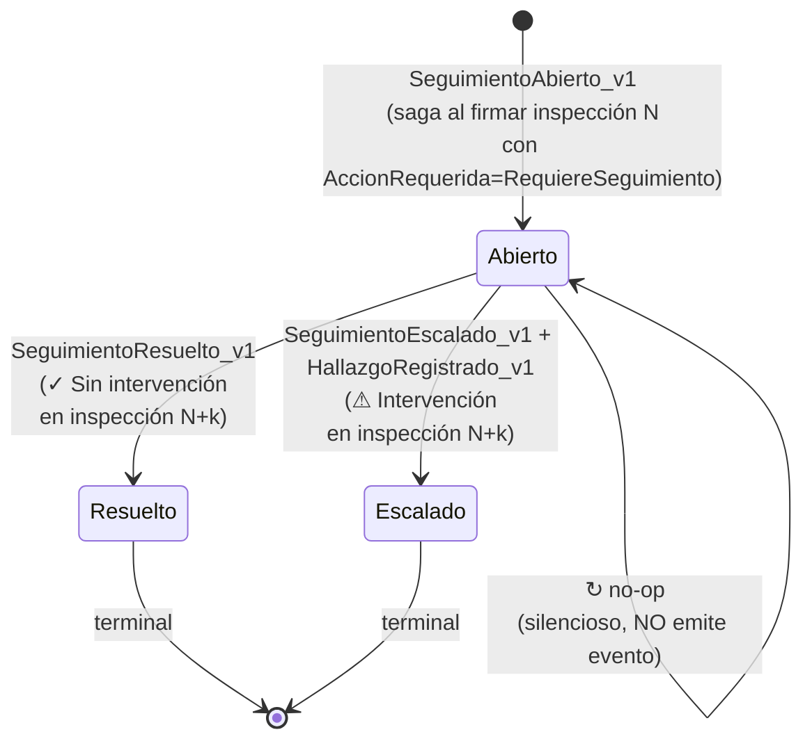
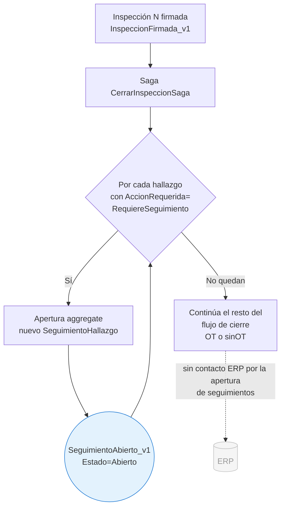
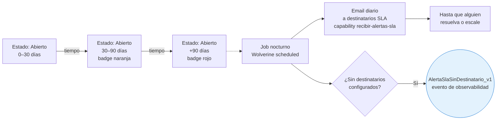

# Flujo de seguimientos (`SeguimientoHallazgo`) — paso a paso con endpoints

**Propósito:** mapa visual del ciclo completo del aggregate paralelo `SeguimientoHallazgo` — desde apertura automática (saga al firmar) hasta resolución o escalación (decisión humana en inspecciones posteriores). Complementa `02f-flujo-inspeccion-tecnica-manual.md` y `02g-flujo-inspeccion-monitoreo.md`.

**Última revisión:** 2026-05-04.

**Modelo de referencia:** `01-modelo-dominio.md` §15.8 (aggregate completo) y §15.9 (patrón unificado de 3 opciones).

**Convenciones del diagrama:** las mismas que `02f` y `02g` (cuadros sólidos = locales, flechas punteadas = ERP, `(outbox)` = vía Wolverine, `(cache local)` = sin llamada ERP).

> **Backend del seguimiento:** stream propio en Marten (event sourcing) — aggregate paralelo a `Inspeccion`. Sigue al **equipo**, no al proyecto (decisión 4 §15.8.5). Cualquier técnico que inspeccione el equipo posteriormente puede cerrarlo o escalarlo.

---

## 1. Resumen del lifecycle



**Estados:**
- `Abierto` — esperando acción humana en una inspección posterior del equipo.
- `Resuelto` — cerrado con "Sin intervención" (terminal — I-S3).
- `Escalado` — convertido a hallazgo `RequiereIntervencion` (terminal — I-S3).

**El `↻ Seguimiento` (revisar sin cambio) NO emite evento** (decisión 2 §15.8.5, invariante I-S4). Solo feedback visual al técnico (toast + card resaltada).

---

## 2. Apertura — saga al firmar inspección con `RequiereSeguimiento`



**Apertura es un evento puramente local** — no toca el ERP. El preop ya recibió el `POST /preop/novedades/{id}/verificar` cuando el técnico asignó la novedad como seguimiento (P-5 vía outbox, durante la inspección N — ver `02f`). El seguimiento es la **vida posterior** del hallazgo dentro del módulo, invisible al ERP.

**Origen del hallazgo que dispara apertura:**
- Hallazgo manual MVP (técnico marca como `RequiereSeguimiento`).
- Hallazgo de novedad preop con `AccionRequerida=RequiereSeguimiento` (variante B, decisión técnica).
- Hallazgo automático de monitoreo Fase 2 (`Origen=Monitoreo`, siempre `RequiereSeguimiento` por invariante).

---

## 3. Vida útil — fondo, SLA, notificación



**SLA visual (§15.8.6):**

| Bucket | Badge | Acción del sistema |
|---|---|---|
| 0–30 días | 🔵 azul "Abierto" | Solo visualización |
| 30–90 días | 🟠 naranja "Atención" | Solo visualización |
| +90 días | 🔴 rojo "Vencido" | Email diario a destinatarios SLA del equipo + visualización |

**Lo que NO ocurre:**
- ❌ NO se genera OT automática (faltan datos: TipoFalla, CausaFalla, repuestos).
- ❌ NO se bloquea inspección si hay seguimientos vencidos.
- ❌ NO se cambia el estado del aggregate solo por tiempo (siempre requiere acción humana).

**Job de SLA (background):** Wolverine scheduled task escanea seguimientos `Estado=Abierto AND AbiertoEn < now-90d` → consulta `DestinatariosAlertasSlaPorEquipo` → envía email a cada usuario con capability `recibir-alertas-sla` configurado para ese equipo. Si la lista está vacía, emite `AlertaSlaSinDestinatario_v1` (no falla silenciosamente).

> **Implicación operativa:** los destinatarios SLA viajan en el catálogo de proyectos/equipos sincronizado desde MYE. **Pendiente confirmar con David** la fuente del campo del lado ERP (ver §15.8.6).

---

## 4. Resolución o escalación — flujo principal

El técnico decide qué hacer con un seguimiento previo durante una inspección posterior del mismo equipo.

```mermaid
flowchart TD
    Start([Inspección N+k del mismo equipo<br/>EnEjecucion]) --> A[Pantalla 1<br/>banner: 'X seguimientos previos']
    A --> B[Tap '↻ Traer de seguimiento [N]'<br/>botón de barra inferior]
    B --> C[Pantalla 2<br/>lista de seguimientos abiertos del equipo]
    C -.->|"Proyección local<br/>SeguimientosAbiertosPorEquipoView<br/>§15.12.4"| Cache[(Marten read model)]:::muted

    C --> D{Tap en seguimiento<br/>3 acciones}

    %% === RESOLVER ===
    D -->|✓ Sin intervención| E[Modal motivo<br/>texto libre obligatorio]
    E --> F[Comando ResolverSeguimiento]
    F --> G((SeguimientoResuelto_v1<br/>Estado=Resuelto<br/>terminal)):::evt
    G --> H[Card desaparece<br/>de la lista]
    H --> End1([✓ Resuelto<br/>sin contacto ERP]):::ok

    %% === REVISAR (no-op) ===
    D -->|↻ Seguimiento| I[Toast 'Marcado como revisado']
    I --> J[Card resaltada<br/>visualmente]
    J --> K[NO emite evento<br/>I-S4]:::muted
    K --> End2([↻ Sin cambio<br/>vuelve a la lista]):::ok

    %% === ESCALAR ===
    D -->|⚠ Intervención| L[Wizard hallazgo<br/>2 pasos]
    L --> L1[Paso 1: parte+actividad+<br/>descripción AccionRequerida=<br/>RequiereIntervencion]
    L1 --> L2[Paso 2: tipo+causa de falla<br/>+ repuestos opcionales]
    L2 --> M[Comando EscalarSeguimiento]
    M --> N((Atómico — único SaveChangesAsync:<br/>SeguimientoEscalado_v1 stream del seguimiento<br/>+ HallazgoRegistrado_v1 stream inspección actual<br/>Origen=Seguimiento + SeguimientoOrigenId)):::evt
    N --> O[Card desaparece<br/>de la lista]
    O --> P[Hallazgo aparece<br/>en lista de inspección actual]
    P --> Q{Adjuntar foto al hallazgo<br/>opcional}
    Q -->|Sí| R[SAS upload a Azure Blob]
    R --> S((AdjuntoSubido_v1)):::evt
    S --> T
    Q -->|No| T[Continuar inspección<br/>actual]
    T --> End3([⚠ Escalado<br/>se procesa al firmar<br/>la inspección actual]):::ok

    classDef evt fill:#e3f2fd,stroke:#1976d2
    classDef ok fill:#e8f5e9,stroke:#388e3c
    classDef muted fill:#f5f5f5,stroke:#bdbdbd,color:#666
```

---

## 5. Atomicidad de la escalación (cross-aggregate)

La escalación toca **dos aggregates distintos** en una sola transacción (invariante I-S2):

```
Comando EscalarSeguimiento
        │
        ▼
Handler (Wolverine)
        │
        ├──→ Stream "seguimiento-{SeguimientoId}"
        │     └─ append: SeguimientoEscalado_v1
        │
        ├──→ Stream "inspeccion-{InspeccionCierreId}"
        │     └─ append: HallazgoRegistrado_v1
        │           con Origen=Seguimiento +
        │           SeguimientoOrigenId apuntando atrás
        │
        └──→ session.SaveChangesAsync()  ◀── único, atomic
```

**Si SaveChanges falla,** ni el seguimiento queda escalado ni el hallazgo nuevo se emite. Coherencia preservada.

**Trazabilidad bidireccional:**
- `SeguimientoEscalado_v1.HallazgoEscaladoId` → forward al nuevo hallazgo en la inspección actual.
- `HallazgoRegistrado_v1.Origen=Seguimiento + SeguimientoOrigenId` → backward al seguimiento original.
- La cadena permite reconstruir "este hallazgo viene del seguimiento S, abierto en la inspección X meses atrás" sin proyecciones laterales.

---

## 6. Endpoints invocados durante el ciclo del seguimiento

| Fase | Endpoint | ¿Se llama? | Notas |
|---|---|---|---|
| **Apertura** (saga post-firma N) | — | **Ninguno** | Local. El preop ya recibió P-5 cuando se asignó la novedad como seguimiento durante la inspección N. |
| **Vida útil** (días/semanas) | — | **Ninguno** | Solo job nocturno de SLA. El job envía email; no contacta el ERP. |
| **Listar seguimientos del equipo** | — | **Ninguno** (lectura local) | Proyección Marten `SeguimientosAbiertosPorEquipoView`. |
| **Resolver** ✓ | — | **Ninguno** | El preop ya considera la novedad cerrada hace tiempo. |
| **Revisar** ↻ | — | **Ninguno** | No-op silencioso, no toca ni Marten. |
| **Escalar** ⚠ — el hallazgo derivado | — | **Ninguno** **al escalar** | El nuevo hallazgo se procesa al firmar la inspección actual (N+k). Si la inspección N+k al firmar tiene `RequiereIntervencion`, entra al flujo OT estándar (M-1, M-1b) como cualquier hallazgo. |

**Total endpoints ERP del ciclo del seguimiento mismo:** **0 directos**. La integración con el ERP ocurre antes (P-5 al asignar) o después (M-1 si se escala y la inspección N+k genera OT) — nunca por el seguimiento aislado.

---

## 7. Eventos del módulo emitidos a lo largo del ciclo

```
Apertura (saga al firmar inspección N):
1. SeguimientoAbierto_v1                 ← saga CerrarInspeccionSaga
                                            (uno por cada hallazgo con
                                             AccionRequerida=RequiereSeguimiento)

Vida útil (sin eventos del aggregate; solo observabilidad):
   AlertaSlaSinDestinatario_v1 (×N en job nocturno)
                                          ← solo si lista de destinatarios SLA
                                             está vacía para el equipo

Resolución (en inspección N+k posterior):
2a. SeguimientoResuelto_v1               ← comando ResolverSeguimiento
                                            (Estado=Resuelto, terminal)

Revisión sin cambio: NO emite evento (I-S4)
                                          ← decisión 2 §15.8.5 — solo feedback UI

Escalación (en inspección N+k posterior, atómico):
2b. SeguimientoEscalado_v1               ← stream del seguimiento
                                            (Estado=Escalado, terminal)
    + HallazgoRegistrado_v1              ← stream de la inspección N+k
       con Origen=Seguimiento +              (mismo SaveChangesAsync, I-S2)
       SeguimientoOrigenId
```

---

## 8. Decisiones operativas clave (todas en §15.8.5 + §15.8.7)

| # | Decisión | Resolución |
|---|---|---|
| 1 | ¿Quién puede cerrar/escalar? | Cualquier técnico que inspeccione el equipo posteriormente. No requiere capability especial — basta `ejecutar-inspeccion`. |
| 2 | ¿"↻ Seguimiento" emite evento? | **No** — no-op silencioso. Si emerge necesidad de reportería ("hace cuánto nadie revisa"), se agrega `SeguimientoRevisadoSinCambio_v1` como cambio aditivo (no modifica I-S3 ni I-S4). |
| 3 | SLA de seguimientos viejos | Alerta visual progresiva (azul→naranja→rojo) + email diario a destinatarios `recibir-alertas-sla` desde 90 días. **Sin** bloqueo de inspección. **Sin** OT automática. |
| 4 | Visibilidad cross-proyecto | El seguimiento sigue al **equipo**, no al proyecto. Visible desde cualquier proyecto al que el equipo se mueva. |

**Invariantes (§15.8.7):**

- **I-S1**: `SeguimientoEscalado_v1` solo válido si el `HallazgoEscaladoId` apunta a un hallazgo con `AccionRequerida=RequiereIntervencion`. No se "escala" a otro seguimiento.
- **I-S2**: cross-aggregate atomicidad — `SeguimientoEscalado_v1` + `HallazgoRegistrado_v1` en el mismo `SaveChangesAsync`, con `HallazgoEscaladoId` y `HallazgoId` coincidentes.
- **I-S3**: estado terminal — una vez `Resuelto` o `Escalado`, no se aceptan más eventos. Re-emisión lanza `DomainException` en el método de decisión.
- **I-S4**: el "↻ Seguimiento" NO emite evento — invariante explícita.

---

## 9. Patrón unificado §15.9 — las mismas 3 opciones en 3 contextos

El técnico ve los **mismos 3 botones** con los **mismos colores** en los 3 contextos donde decide qué hacer con un hallazgo, novedad o seguimiento:

| Contexto | ✓ Sin intervención (verde) | ↻ Seguimiento (amarillo) | ⚠ Intervención (rojo) |
|---|---|---|---|
| **Hallazgo manual** (wizard) | Cierra paso 1, sin tipo/causa/repuestos | Cierra paso 1, sin tipo/causa/repuestos | Continúa a paso 2 (tipo+causa+repuestos) |
| **Novedad preop** (variante B) | ✗ Descartar — `NovedadPreopDescartada_v1` (sin hallazgo) | `HallazgoRegistrado_v1` con `RequiereSeguimiento` | Wizard 2 pasos → `HallazgoRegistrado_v1` con `RequiereIntervencion` |
| **Seguimiento previo** (este flujo) | `SeguimientoResuelto_v1` | no-op silencioso | `SeguimientoEscalado_v1` + `HallazgoRegistrado_v1` |

**Beneficios:**
- El técnico aprende un único mental model.
- Reportes uniformes ("decisiones tipo X tomadas hoy").
- UX consistente en todo el sistema.

---

## 10. Lo que NO está en este diagrama

- **Edición / cancelación de seguimientos abiertos** — no existen comandos de edición (el seguimiento no tiene campos editables; solo transiciona a Resuelto o Escalado).
- **Comandos administrativos de cierre forzado** (ej. supervisor cierra un seguimiento sin que un técnico lo haya tocado) — fuera de MVP. Si emerge, sería un comando `ForzarCierreSeguimiento` con capability nueva.
- **Reapertura de seguimientos cerrados** — bloqueada por I-S3 (estado terminal). Si se descubre que un seguimiento se cerró por error, se abre uno nuevo con referencia al anterior (cambio aditivo si emerge necesidad).
- **Sincronización del seguimiento con MYE** — el ERP nunca sabe del seguimiento. Si el seguimiento se escala y la inspección N+k genera OT, entonces M-1 lleva la nueva OT al MYE — pero el seguimiento mismo es invisible al ERP.
- **Detalle del job de SLA** (frecuencia exacta, retry, dead-letter) — implementación. El diagrama solo muestra el efecto.

---

## 11. Cómo se conecta con los flujos previos

```
[Flujo Inspección Técnica MVP — 02f]
    └─ Si hay hallazgo con RequiereSeguimiento al firmar
       └─→ Apertura SeguimientoAbierto_v1 ◀── ESTE FLUJO arranca aquí

[Flujo Inspección Monitoreo Fase 2 — 02g]
    └─ Hallazgos automáticos siempre AccionRequerida=RequiereSeguimiento
       └─→ Apertura SeguimientoAbierto_v1 ◀── caso TÍPICO de monitoreo

[Inspección N+k — 02f o 02g]
    └─ Pantalla 1 muestra banner "M seguimientos previos"
       └─→ Técnico abre lista, decide acción (este flujo)
       └─→ Si escala: hallazgo nuevo entra en la inspección N+k
            └─→ Al firmar N+k, sigue el flujo OT del 02f o 02g
```

---

## Referencias cruzadas

- `01-modelo-dominio.md` §15.8 — aggregate `SeguimientoHallazgo` completo.
- `01-modelo-dominio.md` §15.9 — patrón unificado de 3 opciones.
- `01-modelo-dominio.md` §15.12.4 — `SeguimientosAbiertosPorEquipoView` proyección.
- `02d-wireframes-seguimientos.html` — wireframes del flujo.
- `02f-flujo-inspeccion-tecnica-manual.md` — flujo donde nace el seguimiento (MVP).
- `02g-flujo-inspeccion-monitoreo.md` — flujo donde nace el seguimiento (Fase 2).
