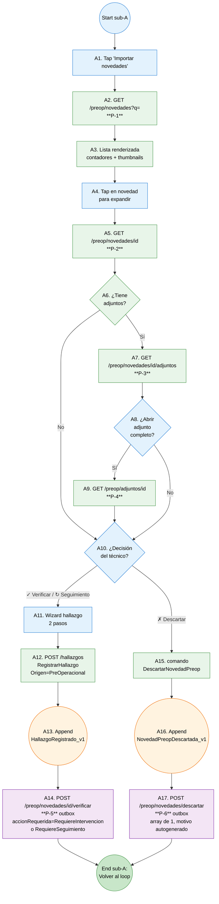
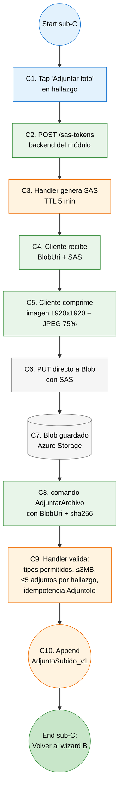

# Workflow de inspección técnica manual — diagrama basado en nodos

**Propósito:** representación tipo workflow engine (estilo BPMN / n8n / Power Automate) del proceso completo de inspección técnica MVP, con **nodos numerados**, **carriles por actor responsable**, **datos explícitos en cada transición**, y sub-workflows para los bucles internos. Complementa `02f-flujo-inspeccion-tecnica-manual.md` (flowchart narrativo) con un nivel adicional de detalle implementacional.

**Última revisión:** 2026-05-04.

**Cuándo usar este doc vs `02f`:**
- **`02f`** — para entender el flujo del técnico de principio a fin (lectura).
- **`02i`** (este) — para implementar el workflow en código, hacer code review por nodo, u onboarding de nuevos devs (referencia técnica).

---

## 1. Carriles (lanes) y notación

Cada nodo del workflow pertenece a uno de 6 carriles que representan al actor/sistema responsable:

| Carril | Color en diagrama | Responsabilidad | Ejemplos |
|---|---|---|---|
| 👤 **Técnico** | azul claro | Decisiones humanas, captura UX | Tap en equipo, llenar wizard, firmar |
| 📱 **Frontend PWA** | verde | Llamadas HTTP síncronas, cache local, validación UI | GET /equipos, GET /preop/novedades, lectura `EquipoLocal` |
| 🔧 **Backend módulo** | naranja | Handlers, aggregates Marten, comandos, validaciones de invariantes | `IniciarInspeccion` handler, append a stream, V-F1..V-F7 |
| ⏰ **Saga / Outbox** | morado | Procesamiento asíncrono Wolverine (retry exponencial, dead-letter, idempotencia) | `CerrarInspeccionSaga`, `EjecutarOTSaga`, `SincronizarDictamenVigenteSaga` |
| 🏢 **ERP on-prem** | rojo | SQL Server relacional (preop, MYE núcleo, inventario) — sin event store | Recibe REST sobre VPN |
| 💾 **Storage** | gris | Azure Blob (adjuntos del módulo) | SAS upload, soft delete |

**Notación de nodos:**

| Forma | Significado | Convención |
|---|---|---|
| `[N. Tarea]` | Actividad / tarea | Acción concreta ejecutable |
| `{N. Pregunta?}` | Decisión / gateway | Bifurcación con etiquetas en arcos de salida |
| `((N. Evento))` | Evento (start, intermediate, end) | Hito puro o terminal |
| `[(N. Datastore)]` | Lectura/escritura de proyección o cache | Marten read model, cache local |
| `[/N. I/O/]` | Datos entrando o saliendo | Payload concreto (DTO, evento) |

**Notación de arcos:** `→` con etiqueta del **dato que pasa** (no solo "siguiente paso").

---

## 2. Workflow completo

```mermaid
flowchart TD
    Start((1. Inicio<br/>Técnico abre PWA)):::lTec

    subgraph FaseInicio["📍 Fase: Iniciar inspección"]
        N2[2. Buscar equipo]:::lTec
        N3[3. GET /equipos?q=<br/>**M-3**]:::lFront
        N4[(4. Cache local<br/>resultados)]:::lFront
        N5[5. Tap en equipo]:::lTec
        N6[6. GET /equipos/equipoCodigo<br/>**M-3b**]:::lFront
        N7[(7. EquipoLocal<br/>+ partes + rutinaTecnicaId)]:::lFront
        N8{8. ¿rutinaTecnicaId<br/>≠ null?}:::lFront
        N9[(9. Query Marten<br/>InspeccionAbiertaPorEquipoView)]:::lFront
        N10{10. ¿Inspección<br/>activa para el<br/>equipo?}:::lFront
        N11[11. Capturar GPS<br/>+ FechaReportada<br/>+ Lecturas medidores]:::lTec
        N12[12. POST /inspecciones<br/>comando IniciarInspeccion]:::lFront
        N13[13. Handler valida<br/>I-I1, I-I2, I-I3]:::lBack
        N14((14. Append<br/>InspeccionIniciada_v1<br/>al stream nuevo)):::lBack
        End2A((2A. End:<br/>Bloqueado I-I2)):::lEnd
        End2B((2B. End:<br/>Reabre existente<br/>I-I1)):::lEnd
    end

    Start --> N2 --> N3 --> N4 --> N5 --> N6 --> N7 --> N8
    N8 -- No --> End2A
    N8 -- Sí --> N9 --> N10
    N10 -- Sí --> End2B
    N10 -- No --> N11 --> N12 --> N13 --> N14 --> Loop

    subgraph LoopBacklog["🔄 Loop: Trabajar con backlog (preop + manual + seguimientos)"]
        Loop{15. ¿Próxima<br/>acción?}:::lTec
        N16[Sub-workflow A:<br/>Importar novedad preop]:::lTec
        N17[Sub-workflow B:<br/>Hallazgo manual]:::lTec
        N18[Sub-workflow C:<br/>Traer de seguimiento]:::lTec
    end

    Loop -- Importar preop --> N16 --> Loop
    Loop -- + Hallazgo manual --> N17 --> Loop
    Loop -- ↻ Seguimiento previo --> N18 --> Loop
    Loop -- Listo, firmar --> N19

    subgraph FaseFirma["✍️ Fase: Firmar"]
        N19[19. Capturar Diagnóstico<br/>+ Dictamen]:::lTec
        N20[20. POST /inspecciones/id/firmar<br/>comando FirmarInspeccion]:::lFront
        N21{21. Validaciones<br/>V-F1..V-F7?}:::lBack
        N22[22. Append atómico:<br/>3 eventos en mismo<br/>SaveChangesAsync]:::lBack
        N23((23. DiagnosticoEmitido_v1<br/>+ DictamenEstablecido_v1<br/>+ InspeccionFirmada_v1)):::lBack
        Back21([Volver a corregir]):::lWarn
    end

    N19 --> N20 --> N21
    N21 -- No --> Back21
    Back21 --> N19
    N21 -- Sí --> N22 --> N23 --> N24

    subgraph FaseSagas["⏰ Fase: Sagas post-firma"]
        N24[24. Sagas reaccionan]:::lSaga
        N25[25. SincronizarDictamenVigenteSaga]:::lSaga
        N26[26. PUT /equipos/codigo/dictamen-vigente<br/>**M-W-1** outbox]:::lSaga
        N27[27. CerrarInspeccionSaga]:::lSaga
        N28{28. ¿Hallazgos con<br/>RequiereSeguimiento?}:::lSaga
        N29[29. Por cada uno:<br/>Append SeguimientoAbierto_v1<br/>en stream nuevo del seguimiento]:::lSaga
        N30{30. ¿Hallazgos con<br/>RequiereIntervencion?}:::lSaga
    end

    N24 --> N25
    N24 --> N27
    N25 --> N26
    N27 --> N28
    N28 -- Sí --> N29 --> N30
    N28 -- No --> N30

    N30 -- No --> N31
    N30 -- Sí --> N40

    subgraph FaseSinOT["✓ Fase: Cierre sin OT"]
        N31((31. Append<br/>InspeccionCerradaSinOT_v1<br/>motivo=AutomaticoSinIntervencion)):::lBack
        N32[32. SignalR push<br/>'Inspección cerrada' al cliente]:::lBack
        End3((3. End:<br/>Sin OT)):::lOk
    end

    N31 --> N32 --> End3

    subgraph FaseAprobOT["⚖️ Fase: Aprobación OT (capability generar-ot)"]
        N40[40. Estado derivado:<br/>EsperandoAprobacionOT]:::lBack
        N41[41. Aprobador entra a<br/>BandejaInspeccionesPendientesOTView]:::lTec
        N42{42. Decisión<br/>Aprobar/Rechazar?}:::lTec
    end

    N40 --> N41 --> N42

    N42 -- Rechazar --> N50
    N42 -- Aprobar OT --> N60

    subgraph FaseRechazo["✗ Fase: Rechazo OT"]
        N50[50. Capturar motivo]:::lTec
        N51[51. comando RechazarGenerarOT]:::lFront
        N52((52. Append atómico:<br/>GeneracionOTRechazada_v1<br/>+ InspeccionCerradaSinOT_v1<br/>motivo=RechazadaPorAprobador)):::lBack
        End5((5. End:<br/>Rechazada)):::lOk
    end

    N50 --> N51 --> N52 --> End5

    subgraph FaseEjecutarOT["🔧 Fase: Ejecutar OT (saga + integración MYE)"]
        N60[60. Capturar Responsable<br/>Proyecto / DepartamentoEquipos]:::lTec
        N61[61. comando GenerarOT]:::lFront
        N62[62. Handler valida I-F4<br/>+ capability]:::lBack
        N63((63. Append OTSolicitada_v1)):::lBack
        N64[64. EjecutarOTSaga<br/>reacciona]:::lSaga
        N65[65. POST /mye/ot-correctivas<br/>**M-1** outbox + retry]:::lSaga
        N66{66. Respuesta MYE}:::lSaga
        N67((67. Append<br/>InspeccionCerrada_v1<br/>+ otCorrectivaIdSinco)):::lBack
        N68[68. GenerarPdfInspeccionSaga<br/>QuestPDF local]:::lSaga
        N69((69. PdfInspeccionGenerado_v1)):::lBack
        N70[70. POST /mye/ot-correctivas/id/adjuntos<br/>**M-1b** multipart outbox]:::lSaga
        N71((71. PdfAdjuntadoAOT_v1)):::lBack
        N72((72. OTGeneracionFallida_v1<br/>estado=CierrePendienteOT)):::lError
        End6((6. End:<br/>OT + PDF exitoso)):::lOk
        Retry([Reintento manual desde<br/>panel admin → vuelve a N60]):::lWarn
    end

    N60 --> N61 --> N62 --> N63 --> N64 --> N65 --> N66
    N66 -- 200 OK --> N67 --> N68 --> N69 --> N70 --> N71 --> End6
    N66 -- 4xx perm o agotó retry --> N72
    N72 --> Retry

    classDef lTec fill:#e3f2fd,stroke:#1976d2,color:#000
    classDef lFront fill:#e8f5e9,stroke:#388e3c,color:#000
    classDef lBack fill:#fff3e0,stroke:#ef6c00,color:#000
    classDef lSaga fill:#f3e5f5,stroke:#7b1fa2,color:#000
    classDef lErp fill:#ffebee,stroke:#d32f2f,color:#000
    classDef lStor fill:#f5f5f5,stroke:#757575,color:#000
    classDef lOk fill:#c8e6c9,stroke:#388e3c,color:#000
    classDef lWarn fill:#fff8e1,stroke:#f57c00,color:#000
    classDef lError fill:#ffcdd2,stroke:#d32f2f,color:#000
    classDef lEnd fill:#eceff1,stroke:#455a64,color:#000
```

---

## 3. Sub-workflow A — Importar novedad del preop

**Endpoints invocados en sub-A:** P-1, P-2, P-3, P-4, P-5 (outbox) o P-6 (outbox).

**Eventos emitidos:** `HallazgoRegistrado_v1` (Origen=PreOperacional) o `NovedadPreopDescartada_v1`.

---

## 4. Sub-workflow B — Hallazgo manual

```mermaid
flowchart TD
    B0((Start sub-B)):::lTec
    B1[B1. Tap '+ Agregar hallazgo']:::lTec
    B2[B2. Wizard paso 1:<br/>parte + descripción +<br/>AccionRequerida]:::lTec
    B3[(B3. Cache local<br/>EquipoLocal.partes)]:::lFront
    B4{B4. ¿AccionRequerida<br/>= RequiereIntervencion?}:::lTec
    B5[B5. Wizard paso 2:<br/>tipo + causa de falla<br/>+ acción correctiva]:::lTec
    B6[(B6. Cache local<br/>CausaFallaLocal +<br/>TipoFallaLocal)]:::lFront
    B7[B7. POST /hallazgos<br/>comando RegistrarHallazgo<br/>Origen=Manual]:::lFront
    B8((B8. Append<br/>HallazgoRegistrado_v1)):::lBack
    B9{B9. ¿Estimar<br/>repuestos?}:::lTec
    B10[B10. Buscar insumo q=]:::lTec
    B11[(B11. Lookup InsumoLocal<br/>cache primero)]:::lFront
    B12{B12. ¿Cache miss?}:::lFront
    B13[B13. GET /insumos?q=<br/>**I-1** fallback]:::lFront
    B14[B14. comando EstimarRepuesto]:::lFront
    B15((B15. Append<br/>RepuestoEstimado_v1)):::lBack
    B16[Sub-workflow C: Adjuntos]:::lTec
    BEnd((End sub-B:<br/>Volver al loop)):::lOk

    B0 --> B1 --> B2 --> B3 --> B4
    B4 -- Sí --> B5 --> B6 --> B7
    B4 -- No --> B7
    B7 --> B8 --> B9
    B9 -- Sí --> B10 --> B11 --> B12
    B12 -- Sí --> B13 --> B14
    B12 -- No --> B14
    B14 --> B15 --> B16
    B9 -- No --> B16
    B16 --> BEnd

    classDef lTec fill:#e3f2fd,stroke:#1976d2,color:#000
    classDef lFront fill:#e8f5e9,stroke:#388e3c,color:#000
    classDef lBack fill:#fff3e0,stroke:#ef6c00,color:#000
    classDef lOk fill:#c8e6c9,stroke:#388e3c,color:#000
```

**Endpoints invocados:** I-1 (fallback opcional). Resto consume cache local.

**Eventos:** `HallazgoRegistrado_v1` (Origen=Manual) + opcional `RepuestoEstimado_v1` (×N).

---

## 5. Sub-workflow C — Adjuntar archivo (técnica MVP — anclado a `HallazgoId`)

**Endpoints invocados:** Ninguno del ERP. Solo backend del módulo (SAS) + Azure Blob (PUT directo).

**Eventos:** `AdjuntoSubido_v1`.

---

## 6. Catálogo de nodos del workflow principal — referencia tabular

| ID | Carril | Tipo | Nombre | Entrada | Salida | Endpoint / Recurso |
|---|---|---|---|---|---|---|
| 1 | 👤 Técnico | event | Inicio (técnico abre PWA) | — | — | — |
| 2 | 👤 | task | Buscar equipo | query string | — | — |
| 3 | 📱 | task | GET equipos liviano | `q=` | array de equipos | **M-3** |
| 4 | 📱 | datastore | Cache local de resultados | response M-3 | — | — |
| 5 | 👤 | task | Tap en equipo seleccionado | equipoCodigo | — | — |
| 6 | 📱 | task | GET detalle equipo | equipoCodigo | EquipoDto + partes + rutinaTecnicaId + rutinasMonitoreoIds | **M-3b** |
| 7 | 📱 | datastore | EquipoLocal poblado | response M-3b | datos en cache | — |
| 8 | 📱 | gateway | ¿rutinaTecnicaId ≠ null? | `equipo.rutinaTecnicaId` | bool | — |
| 9 | 📱 | datastore | Query proyección Marten | EquipoId | InspeccionAbiertaPorEquipo o null | proyección `InspeccionAbiertaPorEquipoView` |
| 10 | 📱 | gateway | ¿inspección activa para el equipo? | resultado del query | bool | — |
| 11 | 👤 | task | Capturar GPS + FechaReportada + Lecturas | sensores móvil + input usuario | UbicacionGps + DateOnly + medidores | — |
| 12 | 📱 | task | POST comando IniciarInspeccion | IniciarInspeccion DTO | — | endpoint del módulo |
| 13 | 🔧 | task | Handler valida I-I1, I-I2, I-I3 | comando | OK / DomainException | — |
| 14 | 🔧 | event | Append InspeccionIniciada_v1 al stream | InspeccionId nuevo | evento persistido | Marten |
| 15 | 👤 | gateway | ¿Próxima acción del técnico? | input usuario | importar/manual/seguim/firmar | — |
| 19 | 👤 | task | Capturar Diagnóstico + Dictamen | input usuario | strings + enum | — |
| 20 | 📱 | task | POST comando FirmarInspeccion | FirmarInspeccion DTO | — | endpoint del módulo |
| 21 | 🔧 | gateway | Validaciones V-F1..V-F7 | estado del aggregate | OK / DomainException | — |
| 22 | 🔧 | task | Append atómico (3 eventos) | aggregate cambios | evento persistido | Marten (1 SaveChangesAsync) |
| 23 | 🔧 | event | DiagnosticoEmitido_v1 + DictamenEstablecido_v1 + InspeccionFirmada_v1 | — | evento → sagas | Marten |
| 24 | ⏰ | task | Sagas reaccionan a InspeccionFirmada_v1 | evento | — | Wolverine |
| 25 | ⏰ | task | SincronizarDictamenVigenteSaga | evento + aggregate | comando outbox | Wolverine |
| 26 | ⏰ | task | PUT dictamen-vigente del equipo | DTO body | 200 OK / 4xx / 5xx | **M-W-1** (outbox + retry) |
| 27 | ⏰ | task | CerrarInspeccionSaga | evento + aggregate | bifurcación | Wolverine |
| 28 | ⏰ | gateway | ¿Hay hallazgos `RequiereSeguimiento`? | hallazgos del aggregate | bool | — |
| 29 | ⏰ | task | Append SeguimientoAbierto_v1 (×N) | por cada hallazgo elegible | evento por aggregate nuevo | Marten |
| 30 | ⏰ | gateway | ¿Hay hallazgos `RequiereIntervencion`? | hallazgos del aggregate | bool | — |
| 31 | 🔧 | event | Append InspeccionCerradaSinOT_v1 motivo=AutomaticoSinIntervencion | — | evento | Marten |
| 32 | 🔧 | task | SignalR push 'Inspección cerrada' | InspeccionId + estado | mensaje al cliente | Azure SignalR |
| 40 | 🔧 | task | Estado derivado EsperandoAprobacionOT | — | proyección actualizada | `BandejaInspeccionesPendientesOTView` |
| 41 | 👤 | task | Aprobador entra a bandeja | capability `generar-ot` | lista | — |
| 42 | 👤 | gateway | ¿Aprobar o rechazar? | decisión humana | — | — |
| 50–52 | 👤/📱/🔧 | tasks | Capturar motivo → comando RechazarGenerarOT → eventos atómicos | motivo libre | `GeneracionOTRechazada_v1` + `InspeccionCerradaSinOT_v1` motivo=RechazadaPorAprobador | Marten |
| 60 | 👤 | task | Capturar Responsable (Proyecto / DeptoEquipos) | enum | — | — |
| 61 | 📱 | task | POST comando GenerarOT | DTO | — | endpoint del módulo |
| 62 | 🔧 | gateway | Handler valida I-F4 + capability | comando + capabilities | OK / DomainException | — |
| 63 | 🔧 | event | Append OTSolicitada_v1 | — | evento → saga | Marten |
| 64 | ⏰ | task | EjecutarOTSaga reacciona | evento | comando outbox | Wolverine |
| 65 | ⏰ | task | POST OT correctiva | DTO body con BOM | 200/4xx/5xx | **M-1** (outbox + retry exponencial) |
| 66 | ⏰ | gateway | Respuesta de MYE | status code | éxito / fallo perm / fallo trans | — |
| 67 | 🔧 | event | Append InspeccionCerrada_v1 | otCorrectivaIdSinco + Numero | evento → saga PDF | Marten |
| 68 | ⏰ | task | GenerarPdfInspeccionSaga | InspeccionId | bytes PDF | QuestPDF local |
| 69 | 🔧 | event | PdfInspeccionGenerado_v1 + BlobUri | — | evento → saga adjunto | Marten |
| 70 | ⏰ | task | POST adjunto PDF a OT | multipart con file + sha256 | 200/404/4xx/5xx | **M-1b** (outbox) |
| 71 | 🔧 | event | PdfAdjuntadoAOT_v1 | adjuntoIdSinco | terminal éxito | Marten |
| 72 | 🔧 | event | OTGeneracionFallida_v1 | estado=CierrePendienteOT | retry manual desde panel admin | Marten |

**Total nodos del workflow principal:** ~50 (excluyendo sub-workflows A, B, C que aportan otros ~30 nodos).

---

## 7. Compensaciones / paths de error

| Path de error | Nodo origen | Nodo destino | Acción del usuario |
|---|---|---|---|
| Bloqueado por I-I2 (sin rutina técnica) | N8 | End 2A | Contactar admin del catálogo en Sinco |
| Inspección activa para el equipo (I-I1) | N10 | End 2B | Reabre la existente en lugar de crear nueva |
| V-F1..V-F7 fallan | N21 | N19 | Volver a corregir antes de re-firmar |
| OT generación fallida (4xx perm o agotó retry) | N66 | N72 → Retry | Reintento manual desde panel admin (vuelve a N60) |
| OT rechazada por aprobador | N42 | N50 | Capturar motivo, cierre sin OT con razón explícita |
| SLA seguimientos vencidos (+90d) | (background) | email diario | Resolver/escalar en próxima inspección del equipo |

**Cancelación** (no mostrada en el workflow para no saturar): el técnico puede ejecutar `CancelarInspeccion` mientras el aggregate está `EnEjecucion`. Emite `InspeccionCancelada_v1` y termina el workflow en estado `Cancelada` (terminal). NO contacta MYE.

---

## 8. Idempotencia y atomicidad — anotaciones por nodo

| Nodo | Garantía | Mecanismo |
|---|---|---|
| N14 (InspeccionIniciada_v1) | Idempotente por InspeccionId | Stream nuevo — Marten rechaza Append si stream ya existe |
| N22 (3 eventos atómicos firma) | Atomicidad transaccional | Único `SaveChangesAsync` (regla dura `CLAUDE.md`) |
| N26 (M-W-1 PUT dictamen) | Idempotencia real lado MYE | Idempotency-Key=InspeccionId, ventana ≥30 días (§1.4 contrato) |
| N29 (SeguimientoAbierto_v1 ×N) | Atomicidad por mismo SaveChangesAsync | Aggregate paralelo, mismo handler |
| N52 (Rechazo + InspeccionCerradaSinOT_v1) | Atomicidad transaccional | Mismo SaveChangesAsync — I-S2 análoga |
| N65 (M-1 POST OT) | Idempotencia real lado MYE | Idempotency-Key=InspeccionId, ventana ≥30 días (ADR-003) |
| N67 (InspeccionCerrada_v1) | Atomicidad post-éxito M-1 | Saga emite el evento solo si M-1 devuelve 200 OK |
| N70 (M-1b PUT adjunto PDF) | Idempotencia real lado MYE | Idempotency-Key={InspeccionId}-pdf, upsert por (otCorrectivaIdSinco, inspeccionId, tipo) |
| Sub-A14 (P-5 verificar) | Idempotencia real lado preop SQL Server | Tabla `idempotency_key → response_body` con key={inspeccionId}-{novedadId} |
| Sub-A17 (P-6 descartar) | Idempotencia real lado preop SQL Server | Misma mecánica que P-5 |
| Sub-C9 (AdjuntarArchivo) | Idempotencia local | Validación `AdjuntoId` ya registrado en aggregate |

---

## 9. Lo que NO está en el diagrama

- **CRUD intermedio** (editar hallazgo, eliminar repuesto, eliminar adjunto) — comandos disponibles en `EnEjecucion` pero no son parte del happy path.
- **Loop de seguimientos previos** (sub-workflow C complementario, ver `02h`) — el botón "↻ Traer de seguimiento" abre la lista y permite Resolver / Escalar / no-op.
- **Job de SLA** de seguimientos — background, ver `02h`.
- **Sync nocturno de catálogos** — pre-condición, ver `02f` §1.
- **Reintentos de Wolverine** explícitos (5s → 30s → 2m → 10m → dead-letter) — el nodo N72 los abstrae.
- **Validaciones de detalle** (max 4000 chars, formato GPS, etc.) — están en los handlers pero no se muestran como nodos.

---

## Referencias cruzadas

- `02f-flujo-inspeccion-tecnica-manual.md` — flowchart narrativo (lectura).
- `02g-flujo-inspeccion-monitoreo.md` — flujo Fase 2 (variante estructurada).
- `02h-flujo-seguimientos.md` — ciclo del aggregate `SeguimientoHallazgo` (apertura post-firma + resolución/escalación).
- `01-modelo-dominio.md` §15 — modelo y eventos vigentes (fuente de verdad).
- `06-contrato-apis-erp.md` — contratos detallados de cada endpoint.
- `05-catalogo-eventos.md` — fichas por evento.
