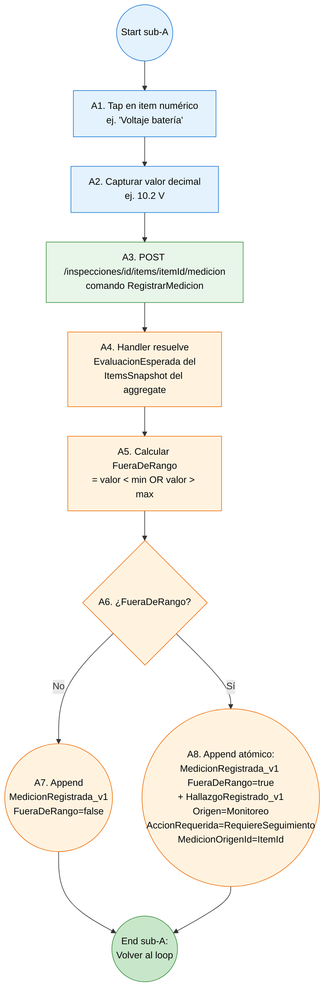
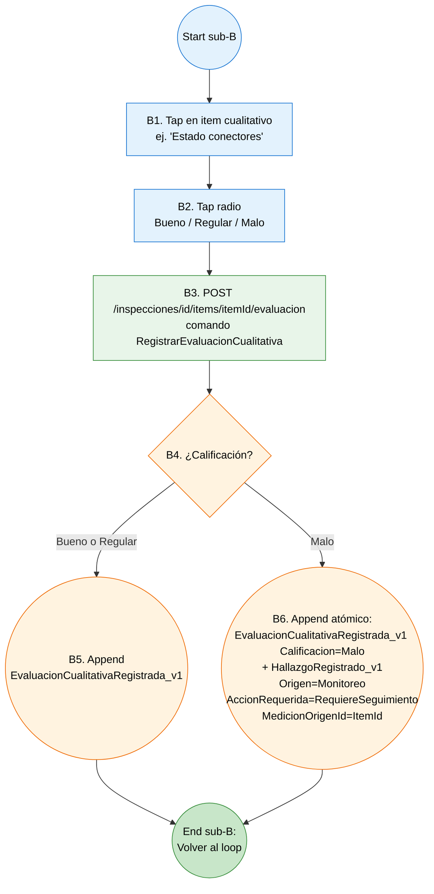
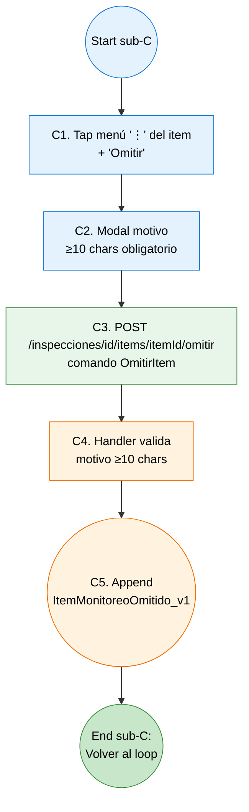
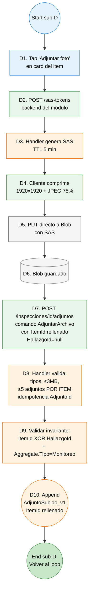

# Workflow de inspección de monitoreo (Fase 2) — diagrama basado en nodos

**Propósito:** representación tipo workflow engine (estilo BPMN / n8n) del proceso completo de inspección de tipo **Monitoreo** (Fase 2), con nodos numerados, carriles por actor, datos explícitos en transiciones, y sub-workflows para los bucles internos. Complementa `02g-flujo-inspeccion-monitoreo.md` (flowchart narrativo).

**Última revisión:** 2026-05-04.

**Estado:** Fase 2 — todavía no implementado en código (roadmap 10.4). Este doc se materializa cuando se priorice.

**Cuándo usar este doc vs `02g`:**
- **`02g`** — lectura narrativa del flujo (UX / PO / overview).
- **`02j`** (este) — implementación / code review por nodo / onboarding técnico (devs).

---

## 1. Carriles (lanes) y notación

Misma convención que `02i`. 6 carriles:

| Carril | Color | Responsabilidad |
|---|---|---|
| 👤 **Técnico** | azul claro | Decisiones humanas, captura UX |
| 📱 **Frontend PWA** | verde | Llamadas HTTP síncronas, cache local, validación UI |
| 🔧 **Backend módulo** | naranja | Handlers, aggregates Marten, validaciones de invariantes |
| ⏰ **Saga / Outbox** | morado | Procesamiento asíncrono Wolverine |
| 🏢 **ERP on-prem** | rojo | SQL Server (preop, MYE núcleo, inventario) |
| 💾 **Storage** | gris | Azure Blob (adjuntos del módulo) |

**Notación de nodos** (igual que `02i`):
- `[N. Tarea]` rectángulo = actividad
- `{N. Pregunta?}` rombo = decisión/gateway
- `((N. Evento))` círculo = evento (start/intermediate/end)
- `[(N. Datastore)]` cilindro = lectura/escritura de proyección o cache

---

## 2. Workflow completo

```mermaid
flowchart TD
    Start((1. Inicio<br/>Técnico abre PWA)):::lTec

    subgraph FaseInicio["📍 Fase: Iniciar inspección de monitoreo"]
        N2[2. Buscar equipo]:::lTec
        N3[3. GET /equipos?q=<br/>**M-3**]:::lFront
        N4[(4. Cache local)]:::lFront
        N5[5. Tap en equipo]:::lTec
        N6[6. GET /equipos/equipoCodigo<br/>**M-3b**]:::lFront
        N7[(7. EquipoLocal<br/>+ rutinasMonitoreoIds)]:::lFront
        N8{8. ¿rutinasMonitoreoIds<br/>≠ vacío?}:::lFront
        End2A((2A. End:<br/>Bloqueado<br/>'sin rutinas asignadas')):::lEnd
        N9[9. Modal 'Iniciar inspección']:::lTec
        N10{10. Tipo<br/>Tecnica / Monitoreo}:::lTec
        N11[11. Ver flujo técnica<br/>02f / 02i]:::lTec
        N12[12. Selector de rutina<br/>cards de las 2-3 asignadas]:::lTec
        N13[(13. Resolver definiciones<br/>contra RutinaMonitoreoLocal)]:::lFront
        N14[14. Tap en card<br/>ej. 'Sistema eléctrico']:::lTec
        N15[(15. Query Marten<br/>InspeccionAbiertaPorEquipoView)]:::lFront
        N16{16. ¿Inspección<br/>activa para equipo?}:::lFront
        End2B((2B. End:<br/>Reabre existente)):::lEnd
        N17[17. Capturar GPS<br/>+ FechaReportada<br/>+ Lecturas medidores]:::lTec
        N18[18. POST /inspecciones-monitoreo<br/>comando IniciarInspeccionMonitoreo]:::lFront
        N19[19. Handler valida:<br/>I-I1, I-I3,<br/>RutinaMonitoreoId ∈ Equipo.RutinasMonitoreoIds<br/>Rutina tiene ≥1 item]:::lBack
        N20((20. Append<br/>InspeccionIniciada_v1<br/>Tipo=Monitoreo<br/>+ RutinaMonitoreoSeleccionadaId<br/>+ ItemsSnapshot)):::lBack
    end

    Start --> N2 --> N3 --> N4 --> N5 --> N6 --> N7 --> N8
    N8 -- No --> End2A
    N8 -- Sí --> N9 --> N10
    N10 -- Tecnica --> N11
    N10 -- Monitoreo --> N12 --> N13 --> N14 --> N15 --> N16
    N16 -- Sí --> End2B
    N16 -- No --> N17 --> N18 --> N19 --> N20 --> Loop

    subgraph LoopItems["🔄 Loop: Recorrer items del checklist"]
        Loop{21. ¿Próximo item<br/>o terminar?}:::lTec
        N22[Sub-workflow A:<br/>Capturar item numérico]:::lTec
        N23[Sub-workflow B:<br/>Capturar item cualitativo]:::lTec
        N24[Sub-workflow C:<br/>Omitir item]:::lTec
        N25[Sub-workflow D:<br/>Adjuntar foto al item<br/>opcional anclado a ItemId]:::lTec
    end

    Loop -- Numérico --> N22 --> Loop
    Loop -- Cualitativo --> N23 --> Loop
    Loop -- Omitir --> N24 --> Loop
    Loop -- Foto al item --> N25 --> Loop
    Loop -- Recorrido completo --> N30

    subgraph FaseHallazgoManual["🔧 Fase opcional: Hallazgo manual fuera de rutina"]
        N30{30. ¿Agregar<br/>hallazgo manual?}:::lTec
        N31[Sub-workflow E:<br/>Hallazgo manual<br/>como 02i sub-B]:::lTec
    end

    N30 -- Sí --> N31 --> N30
    N30 -- No --> N40

    subgraph FaseFirma["✍️ Fase: Firmar"]
        N40[40. Capturar Diagnóstico<br/>+ Dictamen V-F4]:::lTec
        N41[41. POST /inspecciones/id/firmar]:::lFront
        N42{42. V-F1..V-F7?}:::lBack
        N43[43. Append atómico:<br/>3 eventos]:::lBack
        N44((44. DiagnosticoEmitido_v1<br/>+ DictamenEstablecido_v1<br/>+ InspeccionFirmada_v1)):::lBack
        Back42([Volver a corregir]):::lWarn
    end

    N40 --> N41 --> N42
    N42 -- No --> Back42 --> N40
    N42 -- Sí --> N43 --> N44 --> N50

    subgraph FaseSagas["⏰ Fase: Sagas post-firma"]
        N50[50. Sagas reaccionan]:::lSaga
        N51[51. SincronizarDictamenVigenteSaga]:::lSaga
        N52[52. PUT /equipos/codigo/dictamen-vigente<br/>**M-W-1** outbox]:::lSaga
        N53[53. CerrarInspeccionSaga]:::lSaga
        N54[(54. Iterar hallazgos)]:::lSaga
        N55{55. ¿AccionRequerida<br/>= RequiereSeguimiento?}:::lSaga
        N56[56. Por cada uno:<br/>Append SeguimientoAbierto_v1<br/>en stream nuevo del seguimiento]:::lSaga
        N57{57. ¿Hay hallazgos<br/>RequiereIntervencion?}:::lSaga
    end

    N50 --> N51 --> N52
    N50 --> N53 --> N54 --> N55
    N55 -- Sí --> N56 --> N57
    N55 -- No --> N57

    N57 -- No --> N60
    N57 -- Sí --> N70

    subgraph FaseSinOT["✓ Fase: Cierre sin OT (típico de monitoreo)"]
        N60((60. Append<br/>InspeccionCerradaSinOT_v1<br/>motivo=AutomaticoSinIntervencion)):::lBack
        N61[61. SignalR push<br/>'Cerrada' al cliente]:::lBack
        End6((6. End:<br/>Sin OT - caso TÍPICO<br/>de monitoreo)):::lOk
    end

    N60 --> N61 --> End6

    subgraph FaseConOT["🔧 Fase: Aprobación OT (atípico — solo si hubo hallazgo manual con RequiereIntervencion)"]
        N70[70. EsperandoAprobacionOT]:::lBack
        N71[71. Aprobador entra<br/>a bandeja]:::lTec
        N72{72. Aprobar/Rechazar?}:::lTec
        N73[73. Mismo flujo que 02i<br/>nodos N50-N72 técnica]:::lBack
        End7((7. End:<br/>Con OT o rechazada)):::lOk
    end

    N70 --> N71 --> N72 --> N73 --> End7

    classDef lTec fill:#e3f2fd,stroke:#1976d2,color:#000
    classDef lFront fill:#e8f5e9,stroke:#388e3c,color:#000
    classDef lBack fill:#fff3e0,stroke:#ef6c00,color:#000
    classDef lSaga fill:#f3e5f5,stroke:#7b1fa2,color:#000
    classDef lOk fill:#c8e6c9,stroke:#388e3c,color:#000
    classDef lWarn fill:#fff8e1,stroke:#f57c00,color:#000
    classDef lEnd fill:#eceff1,stroke:#455a64,color:#000
```

---

## 3. Sub-workflow A — Capturar item numérico

**Atomicidad clave:** A8 emite **dos eventos en un único `SaveChangesAsync`** (regla dura `CLAUDE.md`). Si falla SaveChanges, ni la medición ni el hallazgo quedan. La trazabilidad bidireccional `MedicionOrigenId=ItemId` permite mostrar las fotos del item en la vista del hallazgo automático sin duplicación.

---

## 4. Sub-workflow B — Capturar item cualitativo

**Decisión 2 §12.11.5:** solo `Malo` dispara hallazgo automático. `Regular` queda como dato sin acción inmediata. Si emerge necesidad de tratar `Regular` distinto, es cambio aditivo.

---

## 5. Sub-workflow C — Omitir item

**Casos típicos:** instrumento descargado (ej. multímetro sin pila), condición externa impide medir, parte inaccesible. **No dispara hallazgo automático** — es señalamiento de "no medible esta vez".

---

## 6. Sub-workflow D — Adjuntar foto al item

**Diferencia con técnica:** el adjunto se ancla a `ItemId` (no a `HallazgoId`). Si el item ya disparó hallazgo automático (`MedicionOrigenId=ItemId`), las fotos se muestran en la vista del hallazgo vía el link existente — no se duplican (decisión 12.1, §12.11.5).

**Foto siempre opcional** — la medición / evaluación es la evidencia primaria (decisión 12.2).

---

## 7. Catálogo de nodos del workflow principal — referencia tabular

| ID | Carril | Tipo | Nombre | Entrada | Salida | Endpoint / Recurso |
|---|---|---|---|---|---|---|
| 1 | 👤 | event | Inicio | — | — | — |
| 2–7 | 👤/📱 | tasks/datastore | Buscar y cargar equipo | `q=` / equipoCodigo | EquipoLocal poblado | M-3, M-3b |
| 8 | 📱 | gateway | ¿rutinasMonitoreoIds ≠ vacío? | array | bool | — |
| 9 | 👤 | task | Modal selector de tipo | input | Tecnica/Monitoreo | — |
| 10 | 👤 | gateway | Tipo elegido | enum | branching | — |
| 11 | — | redirect | Ver flujo técnica 02i | — | — | — |
| 12 | 👤 | task | Selector de rutina (2-3 cards) | rutinasMonitoreoIds | tap usuario | — |
| 13 | 📱 | datastore | Resolver definiciones | id elegido | RutinaMonitoreo completa | RutinaMonitoreoLocal |
| 14 | 👤 | task | Tap en card | id elegido | — | — |
| 15–16 | 📱 | datastore/gateway | Check inspección activa I-I1 | EquipoId | bool | InspeccionAbiertaPorEquipoView |
| 17 | 👤 | task | Capturar GPS + fecha + medidores | sensores + input | DTO | — |
| 18 | 📱 | task | POST IniciarInspeccionMonitoreo | DTO | — | endpoint del módulo |
| 19 | 🔧 | gateway | Validar I-I1, I-I3 + asignación + ≥1 item | comando | OK / DomainException | — |
| 20 | 🔧 | event | Append InspeccionIniciada_v1 | — | evento | Marten |
| 21 | 👤 | gateway | Próxima acción del técnico | — | branching | — |
| 22–25 | (sub) | tasks | Sub-workflows A/B/C/D | — | — | — |
| 30 | 👤 | gateway | ¿Agregar hallazgo manual? | — | bool | — |
| 31 | (sub) | task | Sub-workflow E (idem 02i sub-B) | — | — | — |
| 40–44 | 👤/📱/🔧 | tasks/event | Firmar + 3 eventos atómicos | — | evento | Marten (1 SaveChangesAsync) |
| 50 | ⏰ | task | Sagas reaccionan | InspeccionFirmada_v1 | — | Wolverine |
| 51–52 | ⏰ | tasks | Sincronizar dictamen vigente | DTO body | 200/4xx/5xx | M-W-1 (outbox) |
| 53–56 | ⏰ | tasks | CerrarInspeccionSaga abre seguimientos | hallazgos elegibles | SeguimientoAbierto_v1 ×N | Marten |
| 57 | ⏰ | gateway | ¿Hay RequiereIntervencion? | hallazgos | bool | — |
| 60–61 | 🔧 | event/task | Cierre sin OT + push | — | evento + push | Marten + SignalR |
| 70–73 | (link) | tasks | Aprobación OT (mismo flujo 02i) | — | — | M-1, M-1b |

---

## 8. Compensaciones / paths de error

| Path de error | Nodo origen | Nodo destino | Acción |
|---|---|---|---|
| Sin rutinas asignadas | N8 | End 2A | Contactar admin para asignar rutinas al equipo |
| Inspección activa para el equipo (I-I1) | N16 | End 2B | Reabre la existente |
| RutinaMonitoreoId no pertenece al equipo | N19 | DomainException | Re-cargar M-3b |
| Rutina vacía (sin items) | N19 | DomainException | Catálogo inválido — admin |
| V-F1..V-F7 fallan | N42 | N40 | Volver a corregir |
| OT generación fallida (atípico) | N73 | retry manual | Mismo que 02i |

**Items omitidos no son error** — `ItemMonitoreoOmitido_v1` es válido al firmar (no bloquea V-F*).

---

## 9. Idempotencia y atomicidad — anotaciones por nodo

| Nodo | Garantía | Mecanismo |
|---|---|---|
| N20 (InspeccionIniciada_v1) | Idempotente por InspeccionId | Stream nuevo en Marten |
| Sub-A8 (atómico medición + hallazgo) | Atomicidad transaccional | Único `SaveChangesAsync` (regla dura `CLAUDE.md`) |
| Sub-B6 (atómico evaluación + hallazgo) | Atomicidad transaccional | Mismo |
| N43 (3 eventos firma) | Atomicidad transaccional | Mismo |
| N52 (M-W-1) | Idempotencia real lado MYE | Idempotency-Key=InspeccionId |
| N56 (SeguimientoAbierto_v1 ×N) | Atomicidad por mismo SaveChangesAsync | Aggregates paralelos |

---

## 10. Diferencias clave con `02i` (workflow técnica)

| Aspecto | `02i` técnica | `02j` monitoreo |
|---|---|---|
| Asignación rutina↔equipo | `rutinaTecnicaId` singular | `rutinasMonitoreoIds[]` plural (2-3) |
| Selector al iniciar | No (auto-resuelta) | **Sí** (técnico elige entre 2-3 cards) |
| ItemsSnapshot en `InspeccionIniciada_v1` | NO | **SÍ** (necesario para calcular FueraDeRango) |
| Loop principal | Backlog (preop + manual + seguimientos) | Items del checklist (numérico/cualitativo/omitir) |
| Hallazgos automáticos | NO existen | **SÍ** (FueraDeRango / Calificacion=Malo dispara atómicamente) |
| Importar novedades preop | Sí (P-1..P-6) | **No aplica** |
| Adjuntos por defecto | Anclados a `HallazgoId` | Anclados a `ItemId` (xor) |
| Cierre típico | Con OT (M-1, M-1b) | **Sin OT** (`InspeccionCerradaSinOT_v1`) |
| Endpoints ERP del flujo | 12 distintos | 6 distintos |

---

## 11. Lo que NO está en el diagrama

- **Edición de medición previa** (corrección de un valor capturado mid-inspección) — comando `MedicionActualizada_v1` diferido a v1.x post-Fase 2.
- **Cancelación** — `InspeccionCancelada_v1`, terminal sin contacto MYE (igual que técnica).
- **Sub-workflow E** (hallazgo manual) — referencia a `02i sub-B`, no se duplica.
- **Sub-workflow OT atípico** — referencia a `02i nodos N60-N72`, no se duplica.
- **Marca descartada** (medición falsa por instrumento — pendiente Fase 2 §12.11.5 punto 13) — posiblemente evento `MarcaMonitoreoDescartada_v1` futuro.

---

## Referencias cruzadas

- `02g-flujo-inspeccion-monitoreo.md` — flowchart narrativo (lectura).
- `02i-workflow-tecnica-nodos.md` — workflow técnica (referencia para sub-workflows reusados).
- `02e-wireframes-monitoreo.html` — wireframes del flujo.
- `01-modelo-dominio.md` §12.11.5 — modelo completo de monitoreo (puntos 1-13).
- `06-contrato-apis-erp.md` M-3b, M-16 — contratos.
- `roadmap.md` 10.4 — paso de Fase 2.
