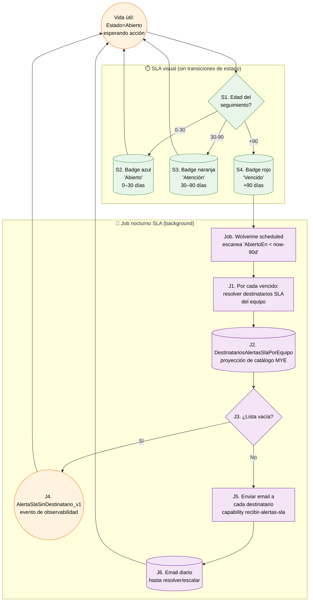

# Workflow del aggregate `SeguimientoHallazgo` — diagrama basado en nodos

**Propósito:** representación tipo workflow engine (estilo BPMN / n8n) del ciclo completo del aggregate paralelo `SeguimientoHallazgo`, con nodos numerados, carriles por actor, datos explícitos en transiciones y atomicidad cross-aggregate de la escalación. Complementa `02h-flujo-seguimientos.md` (flowchart narrativo + state diagram).

**Última revisión:** 2026-05-04.

**Cuándo usar este doc vs `02h`:**
- **`02h`** — lectura narrativa del lifecycle + state diagram + decisiones operativas.
- **`02k`** (este) — implementación / code review por nodo / referencia técnica para devs.

---

## 1. Carriles (lanes) y notación

Misma convención que `02i` y `02j`. 6 carriles posibles, pero el flujo de seguimientos **toca menos**:

| Carril | Color | ¿Usado en este flujo? |
|---|---|---|
| 👤 **Técnico** | azul claro | Sí — al revisar seguimientos previos durante inspección N+k |
| 📱 **Frontend PWA** | verde | Sí — UI de la lista de seguimientos abiertos del equipo |
| 🔧 **Backend módulo** | naranja | Sí — handlers, eventos del aggregate paralelo |
| ⏰ **Saga / Outbox** | morado | Sí — apertura post-firma (saga `CerrarInspeccionSaga`) + job nocturno SLA |
| 🏢 **ERP on-prem** | rojo | **NO** — el seguimiento es invisible al ERP |
| 💾 **Storage** | gris | NO — no hay adjuntos directos al seguimiento (los adjuntos viven en el hallazgo origen o el escalado) |

> **Aspecto distintivo:** **0 endpoints ERP directos** durante todo el ciclo del seguimiento. La integración con el ERP ocurre **antes** (P-5 al asignar la novedad como seguimiento) o **después** (M-1 si el escalado genera OT en la inspección N+k al firmar). El seguimiento es puramente local al módulo Marten.

---

## 2. Workflow completo — Apertura

```mermaid
flowchart TD
    Start((1. Trigger:<br/>InspeccionFirmada_v1<br/>de inspección N)):::lBack

    subgraph FaseApertura["📍 Fase: Apertura automática (saga)"]
        N2[2. Saga<br/>CerrarInspeccionSaga<br/>reacciona]:::lSaga
        N3[(3. Cargar aggregate<br/>InspeccionTecnica de inspección N)]:::lSaga
        N4[(4. Iterar hallazgos no eliminados)]:::lSaga
        N5{5. ¿AccionRequerida<br/>= RequiereSeguimiento?}:::lSaga
        N6[6. Por cada hallazgo elegible:<br/>generar SeguimientoId Guid v7]:::lSaga
        N7[7. Append SeguimientoAbierto_v1<br/>en stream nuevo<br/>'seguimiento-{SeguimientoId}']:::lBack
        N8((8. Estado=Abierto<br/>aggregate vivo)):::lBack
        N9{9. ¿Más hallazgos<br/>elegibles?}:::lSaga
    end

    Start --> N2 --> N3 --> N4 --> N5
    N5 -- Sí --> N6 --> N7 --> N8 --> N9
    N5 -- No --> N9
    N9 -- Sí --> N5
    N9 -- No --> N10

    N10[10. Continúa flujo de cierre<br/>InspeccionCerradaSinOT_v1<br/>o flujo de OT]:::lBack
    N10 --> EndOpen((End apertura:<br/>aggregate(s) vivo(s)<br/>esperando acción humana)):::lOk

    classDef lTec fill:#e3f2fd,stroke:#1976d2,color:#000
    classDef lFront fill:#e8f5e9,stroke:#388e3c,color:#000
    classDef lBack fill:#fff3e0,stroke:#ef6c00,color:#000
    classDef lSaga fill:#f3e5f5,stroke:#7b1fa2,color:#000
    classDef lOk fill:#c8e6c9,stroke:#388e3c,color:#000
```

**Atomicidad de N7:** la saga procesa todos los hallazgos elegibles en un único `SaveChangesAsync` — todos los `SeguimientoAbierto_v1` quedan o ninguno. Coherencia garantizada.

**Origen del hallazgo elegible:**
- Hallazgo manual MVP (técnica) con `RequiereSeguimiento`.
- Hallazgo de novedad preop (variante B) con `RequiereSeguimiento`.
- Hallazgo automático de monitoreo (Fase 2) — siempre `RequiereSeguimiento` por invariante (§12.11.5 punto 8).

---

## 3. Vida útil — SLA + job nocturno



**Importante:**
- El badge visual (S2/S3/S4) **NO transiciona el estado del aggregate** — el aggregate sigue `Abierto` desde 0 a +∞ días hasta que un humano actúa.
- El job nocturno (Job–J6) **NO modifica el aggregate** — solo envía email y, si la lista está vacía, emite un evento de observabilidad (`AlertaSlaSinDestinatario_v1`) que NO pertenece al stream del seguimiento (es un evento global del módulo).

---

## 4. Workflow principal — Resolución / escalación

```mermaid
flowchart TD
    StartK((K1. Inspección N+k<br/>EnEjecucion sobre el equipo)):::lTec

    subgraph FaseDescubrimiento["🔍 Fase: Descubrir seguimientos previos"]
        K2[K2. Pantalla 1<br/>banner 'M seguimientos previos del equipo']:::lFront
        K3[K3. Tap '↻ Traer de seguimiento [M]'<br/>botón de barra inferior]:::lTec
        K4[(K4. Query proyección Marten<br/>SeguimientosAbiertosPorEquipoView<br/>filtrada por EquipoId)]:::lFront
        K5[K5. Pantalla 2<br/>lista de seguimientos abiertos]:::lFront
        K6[K6. Tap en card de un<br/>seguimiento]:::lTec
        K7{K7. ¿Acción del<br/>técnico?<br/>3 botones simétricos §15.9}:::lTec
    end

    StartK --> K2 --> K3 --> K4 --> K5 --> K6 --> K7

    K7 -- ✓ Sin intervención<br/>(verde) --> R1
    K7 -- ↻ Seguimiento<br/>(amarillo) --> X1
    K7 -- ⚠ Intervención<br/>(rojo) --> E1

    subgraph FaseResolver["✓ Fase: Resolver"]
        R1[R1. Modal motivo<br/>texto libre obligatorio]:::lTec
        R2[R2. POST /seguimientos/id/resolver<br/>comando ResolverSeguimiento]:::lFront
        R3[R3. Handler valida I-S3<br/>Estado=Abierto]:::lBack
        R4((R4. Append SeguimientoResuelto_v1<br/>Estado=Resuelto - terminal)):::lBack
        R5[R5. Card desaparece<br/>de la lista]:::lFront
        EndR((End R:<br/>Resuelto - sin contacto ERP)):::lOk
    end

    R1 --> R2 --> R3 --> R4 --> R5 --> EndR

    subgraph FaseRevisar["↻ Fase: Revisar (no-op silencioso)"]
        X1[X1. Toast<br/>'Marcado como revisado']:::lFront
        X2[X2. Card resaltada<br/>visualmente]:::lFront
        X3[X3. NO emite evento<br/>I-S4 explícita]:::lBack
        X4[X4. Sin cambios al stream]:::lBack
        EndX((End X:<br/>Sin cambio - vuelve a la lista)):::lOk
    end

    X1 --> X2 --> X3 --> X4 --> EndX

    subgraph FaseEscalar["⚠ Fase: Escalar (atómico cross-aggregate)"]
        E1[E1. Wizard hallazgo<br/>2 pasos]:::lTec
        E2[E2. Paso 1: parte+actividad+<br/>descripción AccionRequerida=<br/>RequiereIntervencion]:::lTec
        E3[E3. Paso 2: tipo+causa<br/>+ acción correctiva<br/>+ repuestos opcionales]:::lTec
        E4[E4. POST /seguimientos/id/escalar<br/>comando EscalarSeguimiento<br/>+ datos del hallazgo]:::lFront
        E5[E5. Handler valida:<br/>I-S1 RequiereIntervencion<br/>I-S3 Estado=Abierto<br/>I-S2 cross-aggregate atomicidad]:::lBack
        E6[E6. Generar HallazgoId nuevo<br/>Guid v7]:::lBack
        E7((E7. Append atómico - único SaveChangesAsync:<br/>SeguimientoEscalado_v1 stream del seguimiento<br/>+ HallazgoRegistrado_v1 stream inspección N+k<br/>Origen=Seguimiento + SeguimientoOrigenId)):::lBack
        E8[E8. Card desaparece<br/>de lista de seguimientos]:::lFront
        E9[E9. Hallazgo aparece en<br/>lista de inspección N+k actual]:::lFront
        E10{E10. ¿Adjuntar foto<br/>al hallazgo<br/>opcional?}:::lTec
        E11[E11. Sub-workflow C de 02i<br/>SAS upload]:::lTec
        E12[E12. Continuar inspección N+k<br/>regularmente]:::lTec
        EndE((End E:<br/>Escalado - aggregate seguimiento terminal,<br/>hallazgo se procesa al firmar N+k)):::lOk
    end

    E1 --> E2 --> E3 --> E4 --> E5 --> E6 --> E7 --> E8 --> E9 --> E10
    E10 -- Sí --> E11 --> E12
    E10 -- No --> E12
    E12 --> EndE

    classDef lTec fill:#e3f2fd,stroke:#1976d2,color:#000
    classDef lFront fill:#e8f5e9,stroke:#388e3c,color:#000
    classDef lBack fill:#fff3e0,stroke:#ef6c00,color:#000
    classDef lOk fill:#c8e6c9,stroke:#388e3c,color:#000
```

---

## 5. Atomicidad cross-aggregate de la escalación (E7 detallado)

La escalación es el único punto del workflow donde **dos aggregates distintos se modifican en una transacción** (invariante I-S2 §15.8.7):

```
┌────────────────────────────────────────────────────────┐
│ Comando EscalarSeguimiento                             │
│   ├─ SeguimientoId    (del aggregate seguimiento)       │
│   ├─ InspeccionCierreId (donde nace el hallazgo nuevo) │
│   └─ datos del hallazgo (parte, actividad, etc.)       │
└────────────────────────────────────────────────────────┘
                    │
                    ▼
┌────────────────────────────────────────────────────────┐
│ Handler EscalarSeguimientoHandler (Wolverine)          │
│                                                         │
│  Stream "seguimiento-{SeguimientoId}":                 │
│    └─ Append SeguimientoEscalado_v1                     │
│        + HallazgoEscaladoId (forward link)             │
│        + InspeccionCierreId                             │
│                                                         │
│  Stream "inspeccion-{InspeccionCierreId}":             │
│    └─ Append HallazgoRegistrado_v1                     │
│        + Origen=Seguimiento (backward link)            │
│        + SeguimientoOrigenId={SeguimientoId}            │
│        + AccionRequerida=RequiereIntervencion           │
│                                                         │
│  await session.SaveChangesAsync()  ◀── único, atómico  │
└────────────────────────────────────────────────────────┘
                    │
                    ▼
   Si falla: NI seguimiento escalado NI hallazgo nuevo.
   Coherencia preservada por construcción.
```

**Trazabilidad bidireccional resultante:**
- `SeguimientoEscalado_v1.HallazgoEscaladoId` → forward al nuevo hallazgo.
- `HallazgoRegistrado_v1.SeguimientoOrigenId` → backward al seguimiento original.
- La cadena permite reconstruir "este hallazgo viene del seguimiento S, abierto en la inspección X meses atrás" sin proyecciones laterales.

---

## 6. Catálogo de nodos — referencia tabular

### Apertura

| ID | Carril | Tipo | Nombre | Entrada | Salida |
|---|---|---|---|---|---|
| 1 | 🔧 | event | Trigger: InspeccionFirmada_v1 | evento del stream de inspección N | — |
| 2 | ⏰ | task | Saga `CerrarInspeccionSaga` reacciona | evento | — |
| 3 | ⏰ | datastore | Cargar aggregate `InspeccionTecnica` | InspeccionId | aggregate cargado |
| 4 | ⏰ | datastore | Iterar hallazgos no eliminados | aggregate | iterador |
| 5 | ⏰ | gateway | ¿AccionRequerida=RequiereSeguimiento? | hallazgo | bool |
| 6 | ⏰ | task | Generar SeguimientoId Guid v7 | — | Guid |
| 7 | 🔧 | task | Append SeguimientoAbierto_v1 al stream nuevo | datos del hallazgo | evento |
| 8 | 🔧 | event | Estado=Abierto | — | aggregate vivo |
| 9 | ⏰ | gateway | ¿Más hallazgos elegibles? | iterador | bool |
| 10 | 🔧 | task | Continúa flujo de cierre principal | — | flujo OT/sinOT |

### Vida útil (SLA + job)

| ID | Carril | Tipo | Nombre | Entrada | Salida |
|---|---|---|---|---|---|
| S1 | 📱 | gateway | Edad del seguimiento | `now - AbiertoEn` | bucket SLA |
| S2/S3/S4 | 📱 | datastore | Badge visual (azul/naranja/rojo) | bucket | render UI |
| Job | ⏰ | task | Wolverine scheduled task nocturno | — | iterador de seguimientos vencidos |
| J1 | ⏰ | task | Resolver destinatarios SLA del equipo | EquipoId | lista de usernames |
| J2 | ⏰ | datastore | Proyección catálogo MYE | sync on-app-open (cliente) o hidratación on-demand (backend) — ADR-004 canonical 2026-05-05 | DestinatariosAlertasSlaPorEquipo |
| J3 | ⏰ | gateway | ¿Lista vacía? | lista | bool |
| J4 | 🔧 | event | AlertaSlaSinDestinatario_v1 | — | evento de observabilidad |
| J5 | ⏰ | task | Enviar email a cada destinatario | usernames + datos seguimiento | email enviado |
| J6 | ⏰ | datastore | Email diario hasta resolver/escalar | — | side effect |

### Resolución / revisión / escalación

| ID | Carril | Tipo | Nombre | Entrada | Salida |
|---|---|---|---|---|---|
| K1 | 👤 | event | Inspección N+k EnEjecucion sobre equipo | — | — |
| K2 | 📱 | task | Banner 'M seguimientos previos' | proyección | render UI |
| K3 | 👤 | task | Tap '↻ Traer de seguimiento [M]' | — | — |
| K4 | 📱 | datastore | Query SeguimientosAbiertosPorEquipoView | EquipoId | array de seguimientos |
| K5 | 📱 | task | Pantalla 2 lista | array | render UI |
| K6 | 👤 | task | Tap en card | seguimientoId | — |
| K7 | 👤 | gateway | Acción ✓/↻/⚠ | — | branching |
| R1 | 👤 | task | Modal motivo | input | string libre |
| R2 | 📱 | task | POST resolver comando | DTO | — |
| R3 | 🔧 | gateway | Validar I-S3 (Estado=Abierto) | aggregate | OK / DomainException |
| R4 | 🔧 | event | Append SeguimientoResuelto_v1 | — | terminal |
| R5 | 📱 | task | Refrescar lista | — | render UI |
| X1 | 📱 | task | Toast 'Marcado como revisado' | — | UI feedback |
| X2 | 📱 | task | Card resaltada | — | UI feedback |
| X3 | 🔧 | task | NO emite evento (I-S4) | — | sin cambios |
| X4 | 🔧 | task | Sin cambios al stream | — | — |
| E1–E3 | 👤 | tasks | Wizard hallazgo 2 pasos | input usuario | datos del hallazgo |
| E4 | 📱 | task | POST escalar comando | DTO con datos del hallazgo | — |
| E5 | 🔧 | gateway | Validar I-S1, I-S2, I-S3 | comando + aggregates | OK / DomainException |
| E6 | 🔧 | task | Generar HallazgoId nuevo | — | Guid v7 |
| E7 | 🔧 | event | **Append atómico cross-aggregate** | — | 2 eventos en 1 SaveChangesAsync |
| E8 | 📱 | task | Card desaparece de seguimientos | — | UI |
| E9 | 📱 | task | Hallazgo en lista de N+k | — | UI |
| E10 | 👤 | gateway | ¿Adjuntar foto? | — | bool |
| E11 | (sub) | task | Sub-workflow C de 02i (SAS) | — | — |
| E12 | 👤 | task | Continuar inspección N+k | — | — |

---

## 7. Compensaciones / paths de error

| Path de error | Nodo origen | Nodo destino | Acción |
|---|---|---|---|
| Re-emisión sobre estado terminal (I-S3) | R3, E5 | DomainException | "Seguimiento ya cerrado" — refrescar lista |
| HallazgoEscaladoId apunta a hallazgo no-RequiereIntervencion (I-S1) | E5 | DomainException | Validación previa al wizard E1-E3 lo evita |
| Cross-aggregate inconsistencia (I-S2) | E7 | Marten rollback | Si SaveChanges falla, ningún evento queda |
| Lista de destinatarios SLA vacía | J3 | J4 | Evento de observabilidad — alertar al equipo de operaciones |
| Hallazgo escalado luego se cancela (inspección N+k cancelada) | — | El SeguimientoEscalado_v1 NO se revierte | El hallazgo escalado tiene la inspección cancelada como referencia. Nuevo seguimiento NO se abre — el seguimiento ya está terminal en `Escalado`. Hipótesis: si emerge necesidad operativa, evaluar comando `ReabrirSeguimiento` (cambio aditivo). |

---

## 8. Idempotencia y atomicidad — anotaciones por nodo

| Nodo | Garantía | Mecanismo |
|---|---|---|
| N7 (Append SeguimientoAbierto_v1 ×N) | Atomicidad por mismo SaveChangesAsync | Saga procesa todos los hallazgos elegibles en 1 transacción. Cada SeguimientoId es Guid v7 nuevo (sin colisión). |
| R4 (SeguimientoResuelto_v1) | Idempotente vía I-S3 | Re-emisión sobre Estado≠Abierto lanza excepción — dedupe natural |
| E7 (atómico cross-aggregate) | Atomicidad transaccional cross-stream | Único `SaveChangesAsync` para 2 streams (regla dura `CLAUDE.md` + I-S2) |
| Job (escaneo nocturno) | Idempotente por construcción | Cada email es side effect; re-ejecución del job envía email duplicado pero no rompe estado. Si emerge spam, agregar tracking de "último email enviado" por seguimiento. |

---

## 9. Lo que NO está en el diagrama

- **Reapertura de seguimientos cerrados** — bloqueada por I-S3. Si emerge necesidad, comando `ReabrirSeguimiento` aditivo.
- **Comandos administrativos** (cierre forzado por supervisor sin que técnico inspeccione) — fuera de MVP.
- **Sincronización del seguimiento con MYE** — el ERP nunca sabe del seguimiento. Solo aparece en MYE indirectamente cuando un escalado genera OT vía M-1.
- **Reportería de SLA** (dashboard de seguimientos vencidos por proyecto, técnico, etc.) — proyección secundaria, no parte del workflow.
- **Reapertura de un hallazgo escalado** — si la inspección N+k que recibe el escalado se cancela, el hallazgo escalado queda huérfano. Decisión deliberada §15.8: el seguimiento es terminal en `Escalado` aunque la inspección N+k se cancele. No se reabre.

---

## 10. Cómo se conecta con los flujos previos

```
[02i Workflow Técnica MVP] o [02j Workflow Monitoreo Fase 2]
    └─ Firma con hallazgos RequiereSeguimiento
       └─→ Trigger N1 (este workflow): apertura de seguimiento(s)

[Vida útil: días/semanas/meses]
    └─ SLA visual progresivo (S2/S3/S4)
    └─ Job nocturno SLA a +90 días → email a destinatarios

[Inspección N+k del mismo equipo — 02i o 02j]
    └─ Pantalla 1 muestra banner "M seguimientos previos"
       └─→ Workflow K1-K7 (este doc): técnico decide acción
       └─→ Si escala: hallazgo nuevo se procesa al firmar N+k
            └─→ Vuelve al flujo OT del 02i o 02j si AccionRequerida=RequiereIntervencion
```

---

## Referencias cruzadas

- `02h-flujo-seguimientos.md` — flowchart narrativo + state diagram (lectura).
- `02i-workflow-tecnica-nodos.md` — workflow técnica (referencia para sub-workflow C de adjuntos).
- `02j-workflow-monitoreo-nodos.md` — workflow monitoreo (origen frecuente de seguimientos automáticos).
- `01-modelo-dominio.md` §15.8 — aggregate `SeguimientoHallazgo` completo.
- `01-modelo-dominio.md` §15.9 — patrón unificado de 3 opciones.
- `01-modelo-dominio.md` §15.12.4 — proyección `SeguimientosAbiertosPorEquipoView`.
- `02d-wireframes-seguimientos.html` — wireframes del flujo.
